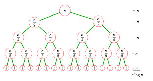

Divide and Conquer Algorithm...!
=======================

## 1. 분할정복 알고리즘 이란?

<br>


<br>

> 한번에 풀기 어려운 문제를 "분할"하여 "정복"하고 결합하는 알고리즘
> 해를 구할 수 있을 만큼 작은 문제로 나눠서 해결함.

<br>

## 2. 언제 사용해야되나?
<br>

    1. 큰 문제를 자연스럽게 작은 문제로 나눌 수 있을 때(여기서 나온 작은 문제는 독립적이다.)
    2. 작은 문제들로 큰 문제를 효율적을 풀 수 있을 때
    
> 분할 정복 문제 같은 경우 실제로 문제 풀이에서는 잘 안쓰이고 병합정렬, 이분탐색등의 알고리즘에서 응용되어 사용한다.

<Br>

## 3. 사용 방법
<br>

> 분할정복 알고리즘은 재귀 패러다임과 비슷하여 재귀가 자주 등장한다. 

<br>

1. 큰 문제를 하나 이상의 작은 문제로 `분할` 한다.
2. 간단한 수준의 작은 문제들을 `정복` 한다.
3. 큰 문제의 답을 구하기 위해 작은 문제들을 `결합`한다.

<br>

## 4. 효율성
<br>



가로 log n개 세로 n개로 O(n * log n)이다.

<br>

어렵고 큰 문제를 작은 문제로 분할하여 풀기 때문에 시간적 비용이 절감된다.


    시간 복잡도 : O(n * log n)

<br>

## 5. 예시
<br>

1. 합병정렬 : [Link](./MergeSort.md)
2. 이분탐색 : [Link](./BinarySearch.md)

``` java
package BaekJoon;

import java.io.*;
import java.util.*;

public class Test {
	// 2 : 01

	static void sort(int[] ary, int start, int mid, int end) {
		int left = start;
		int right = mid+1;
		int index = start;
		int[] temp = new int[ary.length];
		
		while(left <= mid && right <= end) {
			if(ary[left] > ary[right]) {
				temp[index++] = ary[right++];
			}else temp[index++] = ary[left++];
		}
		
		while(left <= mid) temp[index++] = ary[left++];
		while(right <= mid) temp[index++] = ary[right++];
		
		for(int i = start; i < index; i++)
			ary[i] = temp[i];
	}
	
	static void mergeSort(int[] ary, int start, int end) {
		if(start < end) {
			int mid = (start + end) / 2;
			mergeSort(ary, start, mid);
			mergeSort(ary, mid+1, end);
			sort(ary, start, mid, end);
		}
	}
	
	public static void main(String[] args) throws IOException {
		int[] ary = {4, 77, 12, 34, 1, 67, 4, 20, 3, 2, 7, 5, 10};
		
		mergeSort(ary, 0, ary.length-1);
		
		for(int i = 0; i < ary.length; i++) {
			System.out.println(ary[i]);
		}
	}

}

```

<br>

## 6. 기타
<br>

    동적계획법과 다른 이유 : 작은 문제들의 정답이 항상 같다.
	재귀와 다른 이유 : 재귀는 한 조각과 전체로 나누는 대신에 분할 정복은 절반으로 나눈다.

<br>

## 7. 참고
<br>

<br>
