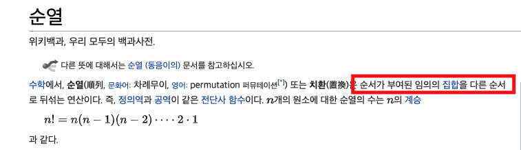

Permutation...!
===============

## 들어가기 전에



순열이란 순서가 있는 집합이다. 즉, 4명의 서로 다른 사람들을 어떻게 줄을 세울 수 있는지에 대한 경우의 수이다.

만약에 {1, 2, 3, 4}의 집합이 존재하고 만약에 이 집합에 순서를 부여하면 다음과 같이 표현할 수 있다.

{1, 2, 3, 4}

{1, 2, 4, 3}

{1, 3, 2, 4}

{1, 3, 4, 2}

{1, 4, 2, 3}

{1, 4, 3, 2}

등으로 표현할 수 있다. 여기서 사용되는 공식은 팩토리얼(!)로 처음의 경우 4자리 중 아무곳이나 갈 수 있고 그 다음은 3자리 그 다음은 2자리 순으로

총 4명일 때 4 * 3 * 2 * 1 = 4!가 나온다.

## 언제 사용하는가?

순열은 완전탐색의 한 종류이다. 

따라서 완전 탐색을 해야하는 경우이면서 모든 경우에서 순서를 고려해야할 때 사용해야한다.

또한 시간복잡도는 O(N!)이므로 데이터가 매우 작을 경우에만 사용한다.

## 어떻게 사용하는가?

visited를 이용하는 방법, swap을 이용하는 방법 등이 있다.

swap을 이용하는 방법은 재귀함수를 사용해주는 것인데 다음과 같다.

```java

static void permutation(int[] arr, int depth, int n, int r){
    if(depth == r){ //한가지의 경우가 나온 경우
        //cal   여기서 목적에 맞는 계산을 해주면 된다.

        return;
    }

    for(int i = depth; i < n; i++){
        //현재 깊이를 아래에 있는 놈들과 바꾼다.
        swap(arr, depth, i);
        
        permutation(arr, depth+1, n, r);

        //원래 자리로 되돌린다.
        swap(arr, depth, i);
    }
}

static void swap(int[] arr, int i, int j){
    int temp = arr[i];
    arr[i] = arr[j];
    arr[j] = temp;
}

```

<Br>


permutation 함수의 매개변수들은 기본으로 주어진 배열, 깊이, 총 갯수, 뽑고자 하는 갯수들로 나뉜다.

여기서 깊이란 일종의 주어진 배열의 인덱스를 말하고 swap을 통해 현재의 인덱스를 뒤에 있는 인덱스들과 바꾼다. (swap(arr, depth, i))

바꾼 후 고정을 하고 그 다음레벨의 인덱스로 반복한다. (permutation(arr, depth+1, n, r) 재귀)

다른 경우의 수도 해야하기 때문에 배열을 원래 위치로 되돌린다. (swap(arr, depth, i))