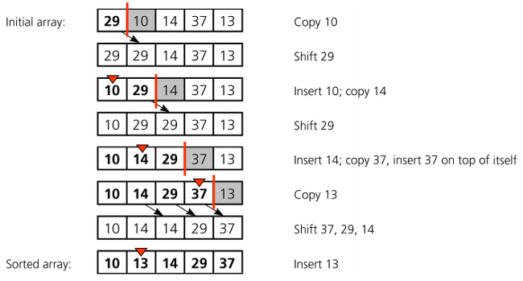
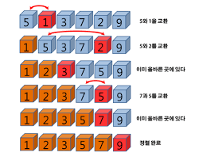
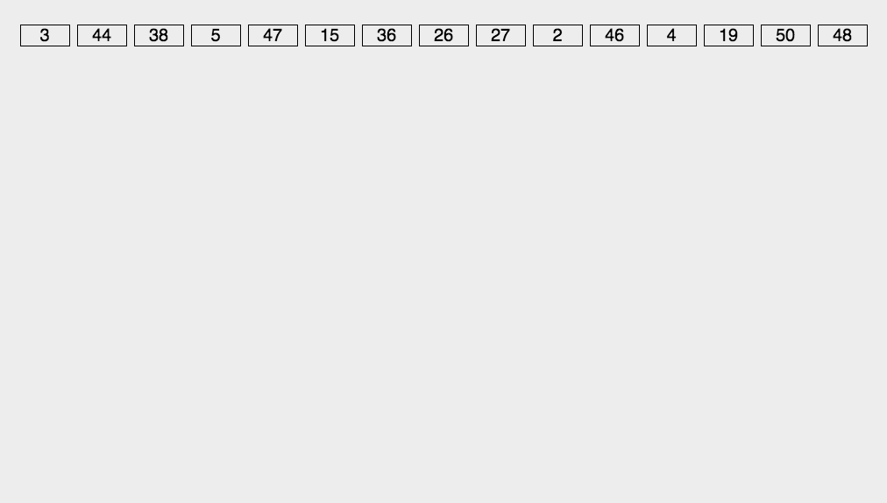

Sorting...!
=======================

## 1. 정렬이란?
 

> 데이터를 특정한 기준에 따라 순서대로 나열하는 것  
> 상황에 맞는 정렬 알고리즘을 사용하면 된다. (데이터가 대부분 정렬되었을 때, 범위가 좁을 때, 데이터가 적을 때...)

 

 

## 2. 언제 사용해야되나?
 

    당연한 말이겠지만 정렬이 필요할 때 사용!
    정렬을 하여 실보다 득이 많을 때 사용한다. (복합 문제를 안풀어봐서 ㅎ...)
    
> 다만 정렬 알고리즘은 시간복잡도가 서로 다르기 때문에 유의하여 사용해야한다.

 

##### 해당 언어의 정렬 라이브러리는 오히려 기본 정렬알고리즘 보다 효율성이 뛰어나므로 숙지해야한다. 

 

## 3. 사용 방법
 

### 삽입 정렬
 

> 삽입 정렬은 특정 기준을 잡고 기준점 좌/우측으로 기준값보다 큰/작은 값을 비교 하여 바꾼다. 

##### Ex) 오름차순 정렬 할 때 29를 기준으로 잡고 우측값고 비교하여 만약 기준 값이 크면 서로 바꾼 후 기준이 찾을 때까지 반복한다.

 

### 특징

1. 최선의 경우 O(n)의 시간복잡도를 갖는다. (거의 정렬 되어 있는 상태)
2. 선택 정렬보다는 빠르다.

 
   

### 선택 정렬
 

> 삽입 정렬은 특정 기준을 잡고 기준점 우측으로 기준값보다 가장 큰/작은 값을 선정하여 정렬 한다. 

##### Ex) 오름차순 정렬 할 때 29를 기준으로 잡고 우측으로 가장 작은 값을 찾는다. 이후 기준값과 위치를 바꾼다. 

 

### 특징

1. 직관적이다.
2. O(n^2)의 시간복잡도를 갖는다.
 
   

### 퀵 정렬
 

> 피봇을 설정하고 피봇을 제외한 배열에서 좌/우끝을 기준으로 잡고 서로 값을 비교하여 교환한다. 

##### Ex) 31를 피봇으로 잡고 좌측에서 피봇보다 값이 크면 & 우측에서 피봇보다 값이 작으면 서로 교환한다.

##### 추가로 좌/우 시작점이 커지다 서로 지나치게 되면 그 값중 하나를 피봇과 바꾼다.

 

### 특징

1. 대부분 정렬에서 효율적으로 작용한다.
2. O(nlogn)의 시간복잡도를 갖는다.
3. 최악의 경우 O(n^2)의 시간복잡도를 갖는다. (이미 정렬된 경우)

 
   

### 계수 정렬
 

> 이미지 참고..ㅠ 

 

### 특징

1. 특정 조건이 부합해야지 사용할 수 있다. (범위가 최대 1000000)
2. O(n + k)의 시간복잡도를 갖는다.
3. 최악의 경우 0과 999,999 정렬 경우
4. 동일한 값을 가지는 데이터가 여러개 등장할 때 효과적이다.

 

## 4. 효율성
 

| 알고리즘 | 시간복잡도 | 특징 |
|---|:---:|:---:|
| `버블정렬` | O(n^2) | 일반적이면서도 가장 비효율인 정렬 |
| `선택정렬` | O(n^2) | 가장 일반적인 정렬 |
| `삽입정렬` | O(n^2) |  최선일 경우 O(n) |
| `퀵정렬` | O(nlogn) |  대부분 사용되는 정렬, 최악의 경우 O(n^2)|
| `계수정렬` | O(n + k) |  범위가 짧을 때 사용|
| `팀 정렬` | O(nlogn) |  최선일 경우 O(n), Collections.sort에서 사용|
| `병합정렬` | O(nlogn) |  항상 시간복잡도가 O(nlogn)로 같음|

 

## 5. 예시
 

    보통 정렬 문제는 다른 문제와 엮어서 나와서 정렬문제 자체는 없음...

 

## 6. 기타
 

## **Arrays.sort**와 **Collections.sort**
    실질적으로 정렬 문제에서 가장 많이 이용됨.
    compare 메서드로 논리적으로 구현 할 수 있음.
    Arrays.sort는 Dual-pivot qucik sort알고리즘을 사용하고 Collections.sort는 Tim sort알고리즘을 사용.
##### Tip : return e1 - e2는 오름차순 e2 - e1는 내림차순
 

## 7. 참고
 

 

참조
1. [이코테 정렬](https://freedeveloper.tistory.com/274)