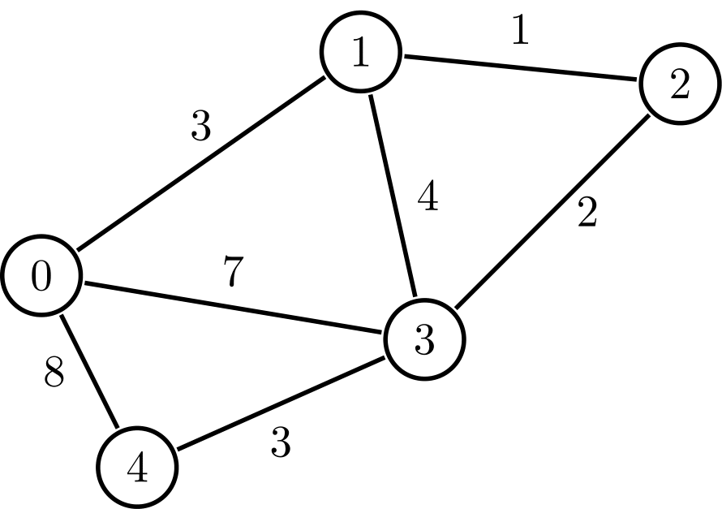
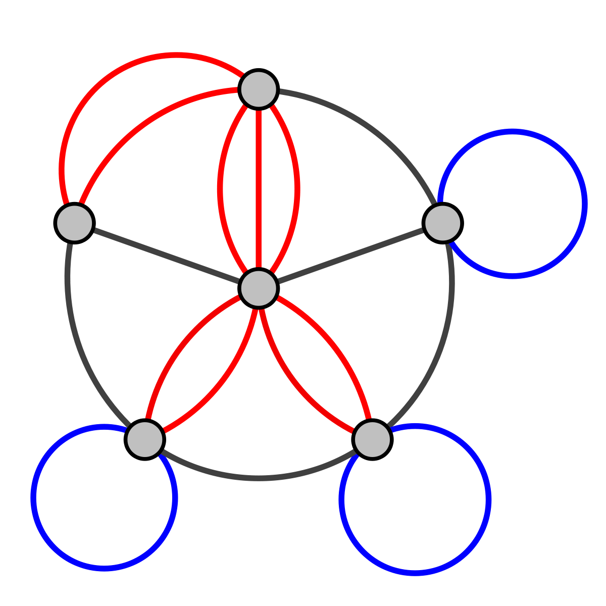

Graph
=====

<br>

## Graph이란?
------

<br>


<br>

그래프는 자바컬렉션프레임워크에 없는 자료구조 중 하나로 알고리즘 문제에 많이 나오는 유형 중 하나입니다. 그래프는 기본적으로 `정점(Vertex)`과 `간선(Edge)`으로 이뤄져 있고 `차수(degree)`와 `인접(adjacent)`이라는 기본용어도 가지고 있습니다.

<br>

여기서 `정점`은 하나의 점을 의미하며 위 이미지로 나타내면 V = {0, 1, 2, 3, 4}로 구성되어있습니다. 그리고 `간선`은 E = {(0,1), (0, 4), (1, 4), (1, 3), (1, 2), (2, 3), (3, 4)}로 구성되어있습니다.

<br>

그래프 기본 용어로 `차수(degree)`가 있습니다. 차수는 하나의 정점이 가지는 간선의 개수로 예를 들어 0의 차수는 (0, 1), (0, 4)로 2개입니다.

<br>

### 구현

<br>

```java
import java.io.*;
import java.util.*;

public class undirectedGraph {
    static int[][] matrixGraph; // adjacent matrix
    static ArrayList<ArrayList<Integer>> listGraph = new ArrayList<>();

	public static void main(String[] args) {
        // 입력이 0 1 / 1 2 / 1 3 등으로 주워지는 상황일 때
        Scanner scanner = new Scanner(System.in);
        matrixGraph = new int[5][5];

        while(scanner.hasNext()){
            int a = scanner.nextInt();
            int b = scanner.nextInt();

            matrixGraph[a][b] = 1;
            matrixGraph[b][a] = 1;
        }

        for(int i = 0; i < end; i++){
            listGraph.add(new ArrayList<>());
        }

        while(scanner.hasNext()){
            int a = scanner.nextInt();
            int b = scanner.nextInt();

            listGraph.get(a).add(b);
            listGraph.get(b).add(a);

        }
    }


}
```

<br>

## 방향그래프
------

<br>


<br>

위의 이미지는 아까와는 다르게 간선에 화살표가 표시되어있습니다. 즉, 방향성이 있다는 것을 알 수 있습니다. 방향성이 있는 그래프를 `방향성 그래프(Directed Graph)`라고 합니다. 에를 들어 A -> B는 방향성에 의해 가능하지만 B -> A 불가능합니다.

<br>

이에따라 차수와 인접한다는 표현 역시 달라집니다. 차수는 indegree, outdegree로 2개로 나눌 수 있게됩니다. 따라서 D의 indegree는 1개고 outdegree로 역시 1개입니다. D와 인접하는 것은 B로 1개입니다.

<br>

#### 추가

방향그래프는 `사이클(Cycle)`이라는 특정한 그래프 형태를 가질 수 있습니다. 사이클은 방향그래프에 있는 한 정점을 간선에 따라 가다보면 다시 처음 시작한 정점으로 오는 형태입니다. 

<br>

### 구현

<br>

```java
import java.io.*;
import java.util.*;

public class directedGraph {
    static int[][] matrixGraph; // adjacent matrix
    static ArrayList<ArrayList<Integer>> listGraph = new ArrayList<>();

	public static void main(String[] args) {
        // 입력이 0 1 / 1 2 / 1 3 등으로 주워지는 상황일 때
        Scanner scanner = new Scanner(System.in);
        matrixGraph = new int[5][5];

        while(scanner.hasNext()){
            int a = scanner.nextInt();
            int b = scanner.nextInt();

            matrixGraph[a][b] = 1;
        }

        for(int i = 0; i < end; i++){
            listGraph.add(new ArrayList<>());
        }

        while(scanner.hasNext()){
            int a = scanner.nextInt();
            int b = scanner.nextInt();

            listGraph.get(a).add(b);

        }
    }


}

```

<br>

## 가중치그래프
------

<br>



<br>

`가중치그래프(Weight Graph)`는 간선들에 가중치가 있는 그래프입니다.
주로 비용, 거리, 대역폭을 의미합니다. 가중치 그래프 역시 방향성을 가질 수 있습니다.

### 구현

<br>

```java
import java.io.*;
import java.util.*;

class Edge<W, V> {
    private W weight;
    private V v;

    public void setEdge(W weight, V v) {
        this.weight = weight;
        this.v = v;
    }
}

public class weightGraph {
    static int[][] matrixGraph; // adjacent matrix
    static ArrayList<Edge<Integer, Integer>> listGraph = new ArrayList<>();

	public static void main(String[] args) {
        // 입력이 0 1 3/ 1 2 1/ 1 3 4등으로 주워지는 상황일 때
        Scanner scanner = new Scanner(System.in);
        matrixGraph = new int[5][5];

        while(scanner.hasNext()){
            int a = scanner.nextInt();
            int b = scanner.nextInt();
            int weight = scanner.nextInt();

            matrixGraph[a][b] = weight;
            matrixGraph[b][a] = weight;
        }   

        

        for (int i = 0; i < end; i++) {
            listGraph.add(new Edge<>());
        }

        for (int i = 0; i < m; i++) { // 간선의 갯수만큼 반복
            int n1 = scanner.nextInt(); // 노드 1
            int n2 = scanner.nextInt(); // 노드 2

            int weight = scanner.nextInt();

            listGraph.get(n1).setEdge(n2, weight);
            listGraph.get(n2).setEdge(n1, weight);
        }
    }


}
```

<br>

## 멀티그래프
------

<br>



<br>

`멀티그래프(multi Graph)`는 중복되는 간선과 같은 정점을 이동하는 간선이 존재할 수 있는 그래프입니다.

### 구현

<br>

```java


```

<br>

## 참고
------

<br>

- [깊이 우선 탐색 알고리즘, 라이](http://blog.naver.com/PostView.nhn?blogId=kks227&logNo=220785731077&parentCategoryNo=&categoryNo=299&viewDate=&isShowPopularPosts=false&from=postList)
- [자바로 그래프구현하기](https://wonit.tistory.com/238?category=758730)

