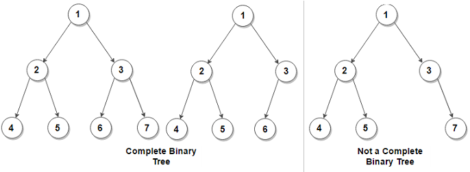
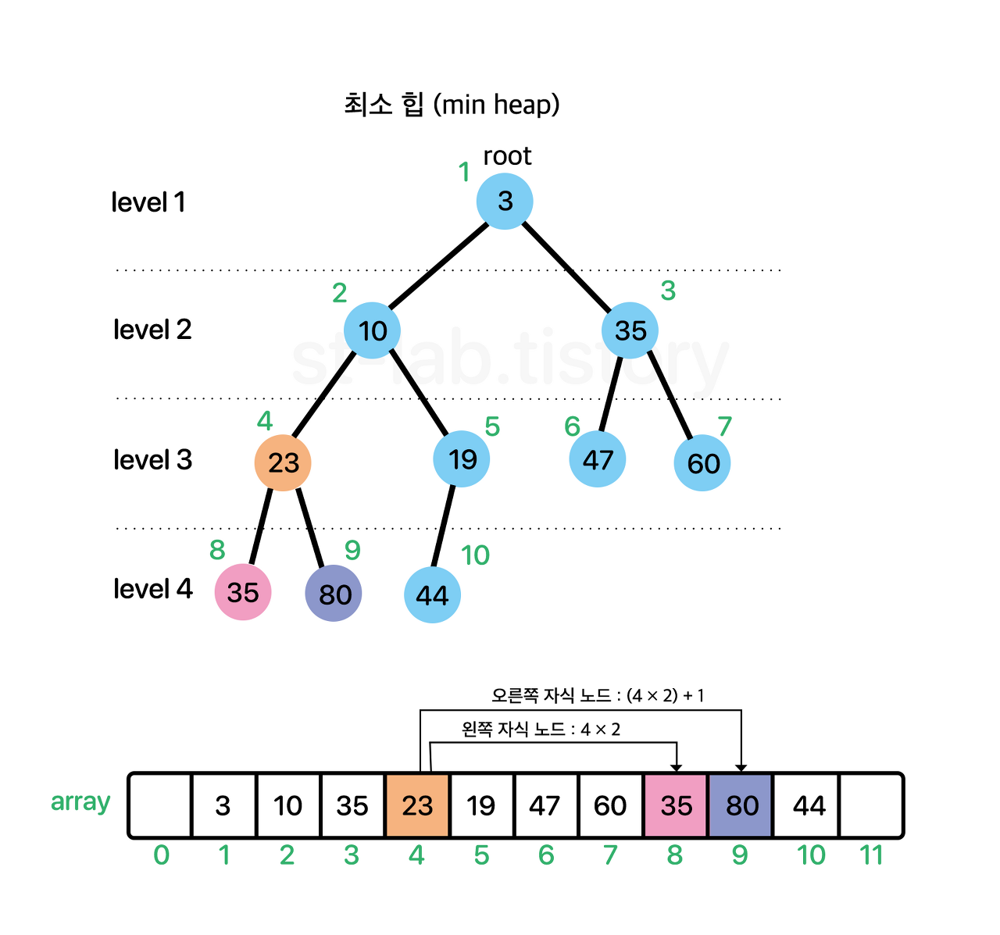

Heap
===

## Heap이란?

> Heap이란 최대/최소 값(우선순위)을 빠르게 꺼내기 위해 완전 이진트리로 구성된 자료구조이다.

### 왜 완전 이진 트리일까?

일반적으로 생각할 수 있는 자료구조인 리스트는 최대/최소를 빠르게 꺼내기 위해서는 정렬을 해야한다.

또한 새로운 값이 추가 되면 기존에 있는 값과 비교를 하고 다시 정렬을 해줘야한다.

따라서 리스트로 Heap을 구현하게 되면 값이 추가 되거나 빠질때마다 정렬을 해줘야하므로 비효율적이다.



이진 트리는 이진 트리, 완전 이진 트리, 포화 이진 트리가 있다.

이진 트리는 한개의 노드가 최대 2개의 자식 노드를 가질 수 있다. 

완전 이진트리는 기존의 이진트리 개념을 더해 형제들을 우선 다 채우고 나서 자식 노드들을 채운다.

포화 이진트리는 완전 이진트리의 개념을 더해 자식노드들을 다 채운다.

> 그렇다면 완전 이진트리는 리스트에 비해 얼마나 빠를까?

    Heap은 완전 이진트리 + 부모노드는 자식노드보다 우선순위가 높다.

2가지 규칙으로 Heap은 시간복잡도가 O(1)를 가질 수 있고 삽입/삭제도 O(logN)을 가진다.

## 왜 Heap을 사용해야하나?

JFC에는 Heap이 없다. 그러나 우선순위 큐가 있는데 이 우선순위 큐는 Heap에 기반이 된다.

Heap은 데이터에 우선순위를 부여하여 우선 순위부터 나올 수 있게 해준다.

데이터에 우선순위가 있을 경우에 사용하면 좋다.

## Heap의 동작원리

Heap 완전 이진트리 구조를 갖지만 코드 상으로 배열로 작성한다.



* 부모노드 인덱스 = 자식노드 인덱스 / 2

* 왼쪽 자식노드 인덱스 = 부모노드 인덱스 * 2

* 오른쪽 자식노드 인덱스 = 부모노드 인덱스 * 2 + 1 

### 데이터 추가

1. 가장 마지막 인덱스에 데이터를 추가한다.
2. 부모노드보다 우선순위가 높으면 부모노드와 위치를 바꾼다.
3. 부모노드가 우선순위가 높을 때까지 2번을 반복한다.

### 데이터 삭제

1. 루트 값을 빼낸다.
2. 가장 마지막에 있는 데이터를 루트로 보낸다.
3. 그에 자식 노드들과 비교해서 가장 우선순위가 높은 노드와 바꾼다.
4. 끝까지 밑에 내려갈 때까지 혹은 자식노드들 보다 우선순위가 높아질 때까지 3번을 반복한다.

## Heap 구현

```java

import java.util.Arrays;
import java.util.Comparator;
import java.util.NoSuchElementException;

public class Heap<E> {

	private final Comparator<? super E> comparator;
	private static final int DEFAULT_CAPACITY = 10;	// 최소(기본) 용적 크기 
    
	private int size;	// 요소 개수 
 
	private Object[] array;	// 요소를 담을 배열 
	
	// 생성자 Type 1 (초기 공간 할당 X)
	public Heap() {
		this(null);
	}
	
	public Heap(Comparator<? super E> comparator) {
		this.array = new Object[DEFAULT_CAPACITY];
		this.size = 0;
		this.comparator = comparator;
	}
    
	// 생성자 Type 2 (초기 공간 할당 O)
	public Heap(int capacity) {
		this(capacity, null);
	}
	
	public Heap(int capacity, Comparator<? super E> comparator) {
		this.array = new Object[capacity];
		this.size = 0;
		this.comparator = comparator;
	}
	
	// 받은 인덱스의 부모 노드 인덱스를 반환
	private int getParent(int index) {
		return index / 2;
	}
	
	// 받은 인덱스의 왼쪽 자식 노드 인덱스를 반환 
	private int getLeftChild(int index) {
		return index * 2;
	}
	
	// 받은 인덱스의 오른쪽 자식 노드 인덱스를 반환
	private int getRightChild(int index) {
		return index * 2 + 1;
	}
	
	/**
	 * @param newCapacity 새로운 용적 크기
	 */
	private void resize(int newCapacity) {
		
		// 새로 만들 배열
		Object[] newArray = new Object[newCapacity];
		
		// 새 배열에 기존에 있던 배열의 요소들을 모두 복사해준다.
		System.arraycopy(array, 0, newArray, 0, newCapacity);
			
		/*
		 *  현재 배열은 GC 처리를 위해 null로 처리한 뒤, 
		 *  새 배열을 연결해준다.  
		 */
		this.array = null;
		this.array = newArray;
			
	}
	
	public void add(E value) {
		
		// 배열 용적이 꽉 차있을 경우 용적을 두 배로 늘려준다. 
		if(size + 1 == array.length) {
			resize(array.length * 2);
		}
			
		siftUp(size + 1, value);	// 가장 마지막에 추가 되는 위치와 넣을 값(타겟)을 넘겨줌
		size++;	// 정상적으로 재배치가 끝나면 사이즈를 증가
	}
	
	// 상향 선별
	/**
	 * @param idx	추가할 노드의 인덱스 
	 * @param target	재배치 할 노드
	 */
	private void siftUp(int idx, E target) {	
		// comparator가 존재할 경우 comparator 을 인자로 넘겨준다.
		if(comparator != null) {
			siftUpComparator(idx, target, comparator);
		}
		else {
			siftUpComparable(idx, target);
		}
	}
	
	// Comparator을 이용한 sift-up
	@SuppressWarnings("unchecked")
	private void siftUpComparator(int idx, E target, Comparator<? super E> comp) {		
	 
		// root노드보다 클 때까지만 탐색한다.
		while(idx > 1) {
			int parent = getParent(idx);	// 삽입노드의 부모노드 인덱스 구하기
			Object parentVal = array[parent];	// 부모노드의 값
			
			// 타겟 노드 값이 부모노드보다 크면 반복문 종료
			if(comp.compare(target, (E) parentVal) >= 0) {
				break;
			}
				
			/*
			 * 부모노드가 타겟노드보다 크므로
			 * 현재 삽입 될 위치에 부모노드 값으로 교체해주고
			 * 타겟 노드의 위치를 부모노드의 위치로 변경해준다. 
			 */
			array[idx] = parentVal;
			idx = parent;
		}
			
		// 최종적으로 삽입될 위치에 타겟 노드 값을 저장해준다.
		array[idx] = target;
	}
	 
	// 삽입 할 객체의 Comparable을 이용한 sift-up
	@SuppressWarnings("unchecked")
	private void siftUpComparable(int idx, E target) {
			
		// 타겟노드가 비교 될 수 있도록 한 변수를 만든다. 
		Comparable<? super E> comp = (Comparable<? super E>) target;
			
		while(idx > 1) {
			int parent = getParent(idx);
			Object parentVal = array[parent];
				
			if(comp.compareTo((E)parentVal) >= 0) {
				break;
			}
			array[idx] = parentVal;
			idx = parent;
		}
		array[idx] = comp;
	}
	
	@SuppressWarnings("unchecked")
	public E remove() {
		if(array[1] == null) {	// 만약 root가 비어있을경우 예외를 던지도록 함
			throw new NoSuchElementException();
		}
	    
		E result = (E) array[1];	// 삭제된 요소를 반환하기 위한 임시 변수 
		E target = (E) array[size];	// 타겟이 될 요소
		array[size] = null;	// 타겟 노드를 비운다.
			
		// 삭제할 노드의 인덱스와 이후 재배치 할 타겟 노드를 넘겨준다.
		siftDown(1, target);	// 루트 노드가 삭제되므로 1을 넘겨준다.
			
		return result;
	}
		
		
	/**
	 * @param idx	삭제할 노드의 인덱스 
	 * @param target	재배치 할 노드
	 */
	private void siftDown(int idx, E target) {
		// comparator가 존재할 경우 comparator 을 인자로 넘겨준다.
		if(comparator != null) {
			siftDownComparator(idx, target, comparator);
		}
		else {
			siftDownComparable(idx, target);
		}
	}
		
	// Comparator을 이용한 sift-down
	@SuppressWarnings("unchecked")
	private void siftDownComparator(int idx, E target, Comparator<? super E> comp) {
		array[idx] = null;
		size--;
		
		int parent = idx;
		int child;
		
		// 끝나는 경우는 최하단까지 내려가서 노드에 자식이 없는 경우
		while((child = getLeftChild(parent)) <= size) { 	
			// 좌측 자식은 있지만 우측 자식은 없을 수도 있음.
			int right = getRightChild(parent);
			
			Object childVal = array[child];
			
			// 해당 조건문을 통해 걸러준다. // 작은 값이 우선이 되므로 작으면 우측으로 바꾼다.
			if(right <= size && comp.compare((E) childVal, (E) array[right]) > 0) {
				child = right;
				childVal = array[child];
			}
			
			// 재배치 할 노드가 자식 노드보다 작을경우 반복문을 종료한다. 
			if(comp.compare(target ,(E) childVal) <= 0){
				break;
			}
			
			array[parent] = child;
			parent = child;
	
		}
		
		array[parent] = target;
		
		/*
		 *  용적의 사이즈가 최소 용적보다는 크면서 요소의 개수가 전체 용적의 1/4일경우 
		 *  용적을 반으로 줄임(단, 최소용적보단 커야함)
		 */
		if(array.length > DEFAULT_CAPACITY && size < array.length / 4) {
			resize(Math.max(DEFAULT_CAPACITY, array.length / 2));
		}
		
	}
	
	// Comparable을 이용한 sift-down
	@SuppressWarnings("unchecked")
	private void siftDownComparable(int idx, E target) {
			
		Comparable<? super E> comp = (Comparable<? super E>) target;
			
		array[idx] = null;
		size--;
			
		int parent = idx;
		int child;
	 
		while((child = getLeftChild(parent)) <= size) {
				
			int right = getRightChild(parent);
				
			Object childVal = array[child];
			
			if(right <= size && ((Comparable<? super E>)childVal).compareTo((E)array[right]) > 0) {
				child = right;
				childVal = array[child];
			}
				
			if(comp.compareTo((E) childVal) <= 0){
				break;
			}
			array[parent] = childVal;
			parent = child;
				
		}
		array[parent] = comp;
			
		if(array.length > DEFAULT_CAPACITY && size < array.length / 4) {
			resize(Math.max(DEFAULT_CAPACITY, array.length / 2));
		}
			
	}
	
	public int size() {
		return this.size;
	}
		
	@SuppressWarnings("unchecked")
	public E peek() {
		if(array[1] == null) {
			throw new NoSuchElementException();
		}		
		return (E)array[1];
	}
	 
	public boolean isEmpty() {
		return size == 0;
	}
	 
	public Object[] toArray() {
		return Arrays.copyOf(array, size + 1);
	}
	
}


```

