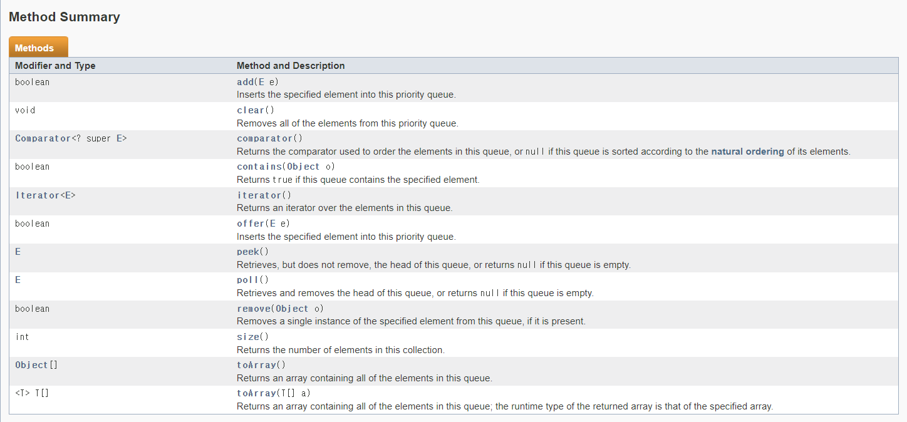

Priority Queue(우선순위 큐)
===

## Priority Queue이란?

>선입 선출의 성격을 가진 Queue와는 다르게 "우선 순위"를 가진 데이터를 우선 출력하는 자료구조이다.

일반적으로 힙을 사용하여 구현한다. [힙이란?](./Heap.md)

## 왜 Priority Queue을 사용해야하나?

    우선순위 큐는 데이터의 "우선순위" 기준으로 출력한다.

다른 자료구조에서는 가질 수 없는 특징으로 사용할 가치가 충분하다고 생각한다.

또한 다익스트라 알고리즘, 프림 알고리즘 등의 알고리즘 뿐만 아니라 시뮬레이션이나 네트워크 트래픽 제어, 운영 체제의 작업 스케줄링, 수치 해석적인 계산 등에서 활용된다.

## Priority Queue의 동작원리

힙 기반으로 동작하기 때문에 힙의 동작원리를 참고하면 된다. [힙이란?](./Heap.md)

### 시간복잡도

시간복잡도는 O(NlogN)을 가진다.

## Priority Queue의 주요 기능



Queue의 메서드들과 비슷하다.

| 메서드 | 기능 |
|:---:|:---:|
| `boolean add(E e)` | 데이터를 추가한다. 예외 발생 O|
| `boolean offer(E e)` | 데이터를 추가한다. 예외 발생 X |
| `E peek()` | 가장 하위에 있는 데이터를 반환한다. |
| `E poll()` | 가장 하위에 있는 데이터를 지우고 반환한다. 예외 발생 X |
| `E remove()` | 가장 하위에 있는 데이터를 지우고 반환한다. 예외 발생 O |

### 추가

> 만약에 큐에 넣을 객체가 기본 클래스가 아니라면?

자체적으로 Comparable를 implements를 하여 compareTo, toString 메서드를 구현한다.

## 테스트 코드

```java

	static class Person implements Comparable<Person>{
		int age;
		int gender;
		String job;
		
		public Person(int age, int gender, String job) {
			this.age = age;
			this.gender = gender;
			this.job = job;
		}

		@Override
		public int compareTo(Person o) {
			// TODO Auto-generated method stub
			return age - o.age;
		}
		
		public String toString() {
			return age + " : " + gender + " : " + job;
		}
	}
	
	
	public static void main(String[] args) {
		PriorityQueue<Integer> pq = new PriorityQueue<Integer>(Collections.reverseOrder());
	
		pq.offer(1);
		pq.offer(44);
		pq.offer(23);
		pq.offer(33);
		pq.offer(0);
		pq.offer(-23);
		pq.offer(19);
		
		while(pq.size() != 0) {
			System.out.println(pq.poll());
		}
		
		PriorityQueue<Person> pq2 = new PriorityQueue<Person>(Collections.reverseOrder());
		
		pq2.offer(new Person(11, -1, "Student"));
		pq2.offer(new Person(14, -1, "Student"));
		pq2.offer(new Person(9, 1, "Student"));
		pq2.offer(new Person(3, 1, "Babu"));
		pq2.offer(new Person(22, -1, "Collage"));
		pq2.offer(new Person(46, -1, "Bussiness Man"));
	
		while(pq2.size() != 0) {
			System.out.println(pq2.poll());
		}
		
	}

```