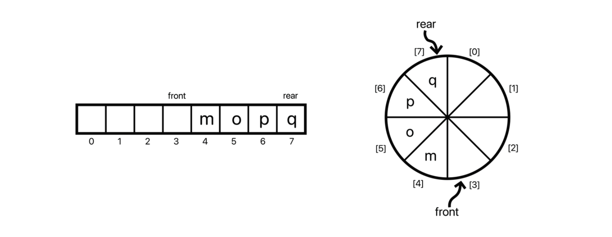
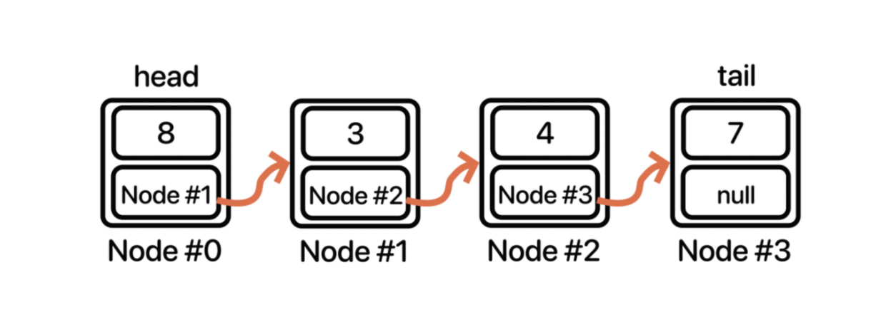
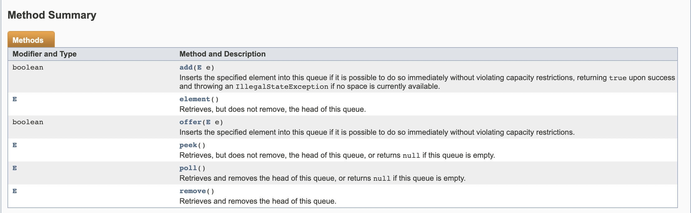

Queue
===

## Queue란?

>큐는 열(column)이다.

<strong>Queue는 Stack과 더불어 LIFI(Last-In First-Out)의 형식을 가진 자료구조이다.</strong>

큐의 대표적인 예시로는 대기'열'이 있다. 

Queue는 인터페이스로 LinkedList를 통해 자바에서는 구현되지만 Array를 사용하여 구현할 수도 있다.

## 왜 Queue을 사용해야하나?

Queue는 대표적인 자료구조로 <strong>먼저 인풋을 입력 받은 데이터</strong>가 먼저 출력되도록 할 때 사용된다.

## Queue의 동작원리

ArrayQueue의 경우 한정적인 길이 때문에 Circular Array로 동작한다.



1. 입력 받은 마지막 데이터 인덱스를 rear이라 하고 가장 앞에 있는 데이터 보다 더 앞에 있는 데이터를 front라고 한다.
2. 만약 배열의 사이즈가 넘어가게 될 경우 나머지 연산자를 사용하여 맨 앞으로 오게한다.

LinkedList Queue의 경우 ArrayQueue와 비슷하게 head와 tail를 만들어 관리한다.



## Queue의 주요 기능

Queue의 기본 기능은 다음과 같다.



## Queue 구현(ArrayQueue)

```java

import java.util.EmptyStackException;
import java.util.NoSuchElementException;

import Interface.Queue;

public class ArrayQueue<E> implements Queue<E> {

	private static final int DEFAULT_CAPACITY = 64;	// 최소(기본) 용적 크기 
	
	private Object[] array;	// 요소를 담을 배열 
	private int size;	// 요소 개수 
	
	private int front;	// 시작 인덱스를 가리키는 변수(빈 공간임을 유의)
	private int rear;	// 마지막 요소의 인덱스를 가리키는 변수 
	
	
	// 생성자1 (초기 용적 할당을 안할 경우)  
	public ArrayQueue() {
		this.array = new Object[DEFAULT_CAPACITY];
		this.size = 0;
		this.front = 0;
		this.rear = 0;
	}
	
	// 생성자2 (초기 용적 할당을 할 경우) 
	public ArrayQueue(int capacity) {
		this.array = new Object[capacity];
		this.size = 0;
		this.front = 0;
		this.rear = 0;
	}
	
	private void resize(int newCapacity) {
		int arrayCapacity = array.length;
		Object[] newArray = new Object[newCapacity];
		
		for(int i = 1, j = front + 1; i <= size; i++, j++ ) {
			newArray[i] = array[j % arrayCapacity];
		}
		
		this.array = null;
		this.array = newArray;
		
		front = 0;
		rear = size;
	}
	
	@Override
	public boolean offer(E e) {
		// 용적이 가득 찼을 경우 
		if((rear + 1) % array.length == front) {
			resize(array.length * 2);	// 용적을 두 배 늘려준다. 
		}
		
		rear = (rear + 1) % array.length;
		array[rear] = e;
		size++;
		
		return true;
	}

	@SuppressWarnings("unchecked")
	@Override
	public E poll() {
		if(size == 0) {
			return null;
		}
		
		front = (front + 1) % array.length;
		E item = (E) array[front];
		
		size--;
		
		// 용적이 최소 크기(64)보다 크고 요소 개수가 1/4 미만일 경우
		if(array.length > DEFAULT_CAPACITY && size < (array.length / 4)) {
				
			// 아무리 작아도 최소용적 미만으로 줄이지는 않도록 한다. 
			resize(Math.max(DEFAULT_CAPACITY, array.length / 2));
		}
		
		return item;
	}
	
	public E remove() {
		E e = poll();
		
		if(e == null) {
			throw new NoSuchElementException();
		}
		
		return e;
	}

	@SuppressWarnings("unchecked")
	@Override
	public E peek() {
		if(size == 0) {
			return null;
		}
		
		front = (front + 1) % array.length;
		return (E) array[front];
	}
	
	public E element() {
		E e = peek();
		
		if(e == null) {
			throw new EmptyStackException();
		}
		
		return e;
	}
	
	public boolean contains(Object value) {
		int start = front + 1;
		int end = rear;
		
		while(start == end) {
			start = start % array.length;
			
			if(array[start].equals(value)) return true;
			
			start++;
		}
		
		return false;
	}

}

```

