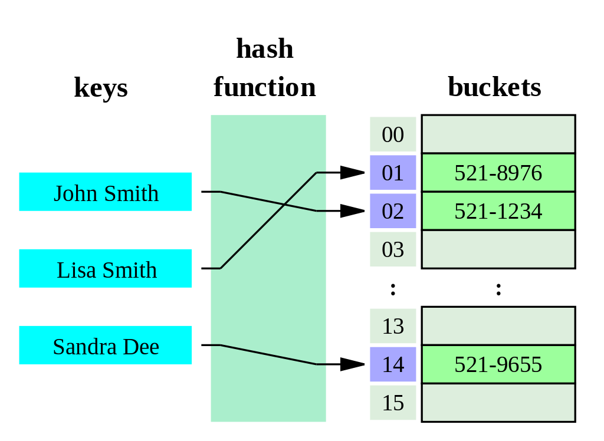
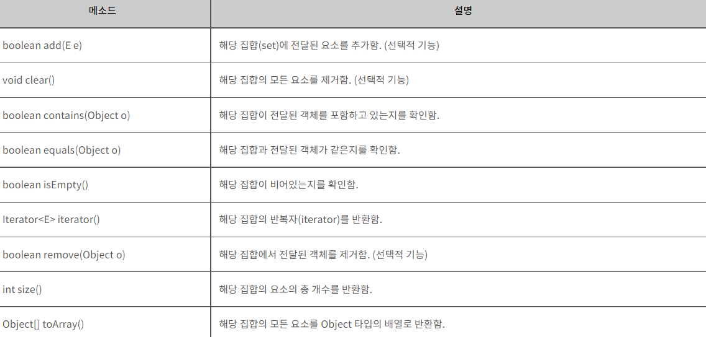

Set
===

## Set이란?

>Set은 집합이라는 의미를 가진다.

<strong>Set은 JFC에 있는 자료구조로 순서가 없고 중복을 허용하지 않는다.</strong>

즉, 집합의 개념과 같다고 생각하면 된다.(집합 역시 {1, 9, 6, 4}처럼 중복과 순서가 없다.)

Set이라는 인터페이스를 통해 자바에서는 3가지의 Set이 있다.

1. Hash 알고리즘을 이용한 HashSet
2. 이진 탐색 트리를 사용하여 오름차순 정렬까지 해주는 TreeSet
3. Set에 순서를 부여해주는 LinkedHashSet 

일반적으로 HashSet, TreeSet, LinkedHashSet 순으로 빠르다.

## 왜 Set을 사용해야하나?

Set의 가장 큰 특징은 바로 순서가 없고 중복을 허용하지 않는다는 것이다.

따라서 비록 위 특징을 List나 다른 자료구조를 통해 커버할 수 있지만 명백한 "속도" 차이가 나기 때문에 Set을 사용하는 것이 좋다.

Set을 사용해야 되는 경우는 다음과 같다.

1. 집합 관련 문제
2. 중복 처리를 고려해야할 때
3. 2번 사항 + 빠르게 찾아야할 때

## Set의 동작원리

HashSet의 경우 Hash 알고리즘 기반으로 동작한다.



1. 입력된 키를 해시 코드로 변환한다.
2. 해시 코드를 인덱스로 한 bucket이라는 array에 해당 인덱스를 찾아 저장한다.(여기서 배열 길이가 초과하는 경우에는 길이의 나머지를 구해 링크드 리스트로 추가한다.)

TreeSet의 경우 이진트리의 향상된 버전인 Red-Black Tree를 기반으로 만들어진다.


1. 새로운 데이터가 들어오면 루트부터 비교한다.
2. 비교의 결과에 따라 우측, 좌측으로 갈지 결정된다.
3. 더 이상 비교를 할 수 없을 때까지 2번을 반복한다.

추가/삭제는 링크드 리스트 보다 비효율적이지만 검색/정렬은 TreeSet이 더 좋다.

[동작원리 설명](https://st-lab.tistory.com/240)

## Set의 주요 기능

Set의 기본 기능은 다음과 같다.



추가적인 기능을 넣으면 다음과 같다.

| 메서드 | 기능 |
|:---:|:---:|
| `boolean addAll(Collection c)` | 주어진 컬렉션에 저장된 모든 객체를 추가한다.(합집합) |
| `boolean containsAll(Collection c)` | 주어진 컬렉션에 저장된 모든 객체를 포함하고 있는지 검사한다.(부분집합 검사) |
| `boolean removeAll(Collection c)` | 주어진 컬렉션에 저장된 모든 객체와 동일한 것들을 모두 삭제한다.(차집합) |
| `boolean retainAll(Collection c)` | 주어진 컬렉션에 저장된 모든 객체와 동일한 것만 남기고 삭제한다.(교집합) |

## Set 구현

```java


public class MyHashSet<E> {

	static class Node<E>{
		final int hash;
		final E key;
		Node<E> next;
		
		public Node(int hash, E data, Node<E> key) {
			this.hash = hash;
			this.key = (E) key;
			this.next = next;
		}
	}
	
	// 최소 기본 용적이며 2^n 꼴 형태가 좋다.
	private final static int DEFAULT_CAPACITY = 1 << 4;
 
	// 3/4 이상 채워질 경우 resize하기 위함
	private final static float LOAD_FACTOR = 0.75f;
 
	Node<E>[] table;	// 요소의 정보를 담고있는 Node를 저장할 Node타입 배열
	private int size;	// 요소의 개수
	
	
	@SuppressWarnings("unchecked")
	public MyHashSet() {
		table = (Node<E>[]) new Node[DEFAULT_CAPACITY];	
		size = 0;
	}
	
	// 보조 해시 함수 (상속 방지를 위해 private static final 선언)
		private static final int hash(Object key) {
			int hash;
			if (key == null) {
				return 0;
			} else {
				// hashCode()의 경우 음수가 나올 수 있으므로 절댓값을 통해 양수로 변환해준다.
				return Math.abs(hash = key.hashCode()) ^ (hash >>> 16);
			}
		}
	
		public boolean add(E e) {
			// key(e)에 대해 만들어두었던 보조해시함수의 값과 key(데이터 e)를 보낸다.
			return add(hash(e), e) == null;
		}
		 
		private E add(int hash, E key) {
		 
			int idx = hash % table.length;
		 
			// table[idx] 가 비어있을 경우 새 노드 생성
			if (table[idx] == null) {
				table[idx] = new Node<E>(hash, key, null);
			}
				
			/*
			 *  talbe[idx]에 요소가 이미 존재할 경우(==해시충돌)
			 *  
			 *  두 가지 경우의 수가 존재
			 *  1. 객체가 같은 경우
			 *  2. 객체는 같지 않으나 얻어진 index가 같은 경우
			 */
			else {
		 
				Node<E> temp = table[idx];	// 현재 위치 노드
				Node<E> prev = null;		// temp의 이전 노드
				
					
				//  첫 노드(table[idx])부터 탐색한다.
				while (temp != null) {
		 
					/*
					 *  만약 현재 노드의 객체가 같은경우(hash값이 같으면서 key가 같을 경우)는 
					 *  HashSet은 중복을 허용하지 않으므로 key를 반납(반환)
					 *  (key가 같은 경우는 주소가 같거나 객체가 같은 경우가 존재)
					 */
					if ((temp.hash == hash) && (temp.key == key || temp.key.equals(key))) {
						return key;
					}
					prev = temp;
					temp = temp.next;	// 다음노드로 이동
				}
		 
				// 마지막 노드에 새 노드를 연결해준다.
				prev.next = new Node<E>(hash, key, null);
			}
			size++;
		 
			// 데이터의 개수가 현재 table 용적의 75%을 넘어가는 경우 용적을 늘려준다.  
			if (size >= LOAD_FACTOR * table.length) {
				resize();	// 아직 미구현 상태임
			}
			return null;	// 정상적으로 추가되었을 경우 null반환
		}
		
		@SuppressWarnings("unchecked")
		private void resize() {
				
			int newCapacity = table.length * 2;
				
			// 기존 테이블의 두배 용적으로 생성
			final Node<E>[] newTable = (Node<E>[]) new Node[newCapacity];
		 
			// 0번째 index부터 차례대로 순회
			for (int i = 0; i < table.length; i++) {
		    
				// 각 인덱스의 첫 번째 노드(head)
				Node<E> value = table[i];
		 
				// 해당 값이 없을 경우 다음으로 넘어간다.
				if (value == null) {
					continue;
				}
		 
		 
				table[i] = null; // gc
		 
				Node<E> nextNode;	// 현재 노드의 다음 노드를 가리키는 변수
					
				// 현재 인덱스에 연결 된 노드들을 순회한다.
				while (value != null) {
		 
					int idx = value.hash % newCapacity;	// 새로운 인덱스를 구한다.
		 
					/*
					 * 새로 담을 index에 요소(노드)가 존재할 경우
					 * == 새로 담을 newTalbe에 index값이 겹칠 경우 (해시 충돌)
					 */
					if (newTable[idx] != null) {
						Node<E> tail = newTable[idx];
		 
						// 가장 마지막 노드로 간다. 
						while (tail.next != null) {
							tail = tail.next;
						}
						/*
						 *  반드시 value가 참조하고 있는 다음 노드와의 연결을 끊어주어야 한다.
						 *  안하면 각 인덱스의 마지막 노드(tail)도 다른 노드를 참조하게 되어버려
						 *  잘못된 참조가 발생할 수 있다.
						 */
						nextNode = value.next;
						value.next = null;
						tail.next = value;
					} 
					// 충돌되지 않는다면(=빈 공간이라면 해당 노드를 추가)
					else {
						
						/*
						 *  반드시 value가 참조하고 있는 다음 노드와의 연결을 끊어주어야 한다.
						 *  안하면 각 인덱스의 마지막 노드(tail)도 다른 노드를 참조하게 되어버려
						 *  잘못된 참조가 발생할 수 있다.
						 */
						nextNode = value.next;
						value.next = null;
						newTable[idx] = value;
					}
		 
					value = nextNode;	// 다음 노드로 이동
				}
			}
			table = null;
			table = newTable;	// 새로 생성한 table을 table변수에 연결
		}
		
		public boolean remove(Object o) {
			// null이 아니라는 것은 노드가 삭제되었다는 의미다.
			return remove(hash(o), o) != null;
		}
			
		private Object remove(int hash, Object key) {
		 
			int idx = hash % table.length;
		 
			Node<E> node = table[idx];
			Node<E> removedNode = null;
			Node<E> prev = null;
		 
			if (node == null) {
				return null;
			}
		 
			while (node != null) {
				// 같은 노드를 찾았다면
				if(node.hash == hash && (node.key == key || node.key.equals(key))) {
						
				removedNode = node; //삭제되는 노드를 반환하기 위해 담아둔다.
						
					// 해당노드의 이전 노드가 존재하지 않는 경우 (= head노드인 경우)
					if (prev == null) {
						table[idx] = node.next;
						node = null;
					} 
					// 그 외엔 이전 노드의 next를 삭제할 노드의 다음노드와 연결해준다.
					else {
						prev.next = node.next;
						node = null;
					}
					size--;
					break;	// 삭제되었기 때문에 탐색 종료
				}
				prev = node;
				node = node.next;
			}
		 
			return removedNode;
		}
	
	
		public int size() {
			return size;
		}
		 
		public boolean isEmpty() {
			return size == 0;
		}
		 
		public boolean contains(Object o) {
			int idx = hash(o) % table.length;
			Node<E> temp = table[idx];
		 
			/*
			 *  같은 객체 내용이어도 hash값은 다를 수 있다.
			 *  하지만, 내용이 같은지를 알아보고 싶을 때 쓰는 메소드이기에
			 *  hash값은 따로 비교 안해주어도 큰 지장 없다.  
			 *  단, o가 null인지는 확인해야한다.
			 */
			while (temp != null) {
				// 같은 객체를 찾았을 경우 true리턴
				if ( o == temp.key || (o != null && temp.key.equals(o))) {
					return true;
				}
				temp = temp.next;
			}
		 
			return false;
		}
			
		public void clear() {
			if (table != null && size > 0) {
				for (int i = 0; i < table.length; i++) {
					table[i] = null;	// 모든 노드를 삭제한다.
				}
				size = 0;
			}
		}
		 
		@SuppressWarnings("unchecked")
		public boolean equals(Object o) {
				
			// 만약 파라미터 객체가 현재 객체와 동일한 객체라면 true
			if(o == this) {
				return true;
			}
			// 만약 o 객체가 Set 계열이 아닌경우 false
			if(!(o instanceof MyHashSet)) {
				return false;
			}
				
			MyHashSet<E> oSet;
			
			/*
			 *  Object로부터 HashSet<E>로 캐스팅 되어야 비교가 가능하기 때문에
			 *  만약 캐스팅이 불가능할 경우 ClassCastException 이 발생한다.
			 *  이 경우 false를 return 하도록 try-catch문을 사용해준다.
			 */
			try {
					
				// Set 타입으로 캐스팅
				oSet = (MyHashSet<E>) o;
				// 사이즈가 다르다는 것은 명백히 다른 객체다.
				if(oSet.size() != size) {
					return false;
				}
					
				for(int i = 0; i < oSet.table.length; i++) {
					Node<E> oTable = oSet.table[i];
										
					while(oTable != null) {
						/*
						 * 서로 Capacity가 다를 수 있기 때문에 index에 연결 된 원소를을
						 * 비교하는 것이 아닌 contains로 원소의 존재 여부를 확인해야한다. 
						 */
						if(!contains(oTable)) {
							return false;
						}
						oTable = oTable.next;
					}
				}
					
			} catch(ClassCastException e) {
				return false;
			}
			// 위 검사가 모두 완료되면 같은 객체임이 증명됨
			return true;
		 
		}

}


```

