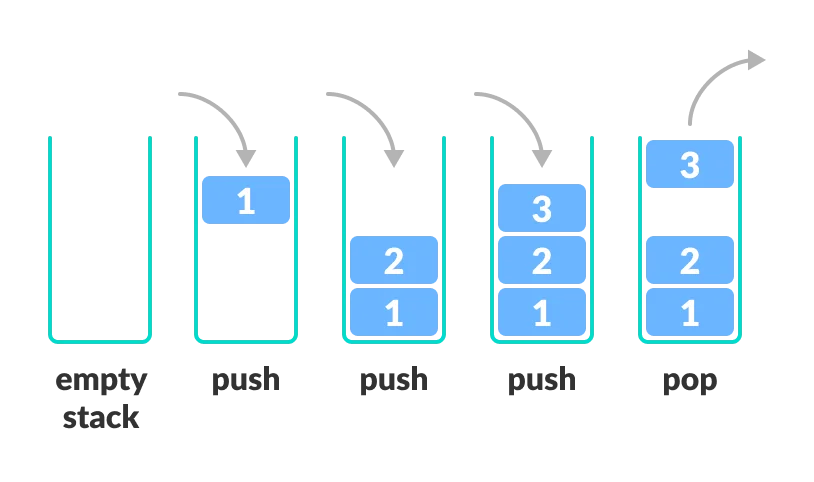

Stack
=====

<br>

## Stack이란?
------



    Stack은 LIFO(Last In - First Out)구조를 가지며 Stack(쌓다)라는 기능을 가진 자료구조입니다.
    하단이 막힌 구조로 위에서 들어오거나 뺄 수 있습니다.

#### 이용사례 : 인터넷 방문기록, undo, 메모리 구조 stack area, ..

<br>

## Stack의 주요 메서드

<br>

- Stack.push(E e) : 매개변수 e를 스택에 넣는다.

- Stack.pop() : 스택 가장 위에 있는 요소를 뺀다.

- Stack.peek() : 스택 가장 위에 있는 요소를 확인한다.

- Stack.size() : 스택안에 있는 요소의 수를 알려준다.

- Stack.isEmpty() : 스택이 비어있는지 확인한다.

- Stack.search(E e) : 해당 위치를 반환한다.

<br>

## Stack 구현

<br>

```java

import java.util.Arrays;
import java.util.EmptyStackException;

import Interface.StackInteface;

public class Stack<E> implements StackInteface<E>{
	private static final int DEFAULT_CAPACITY = 10;	// 최소(기본) 용적 크기 
	private static final Object[] EMPTY_ARRAY = {};	// 빈 배열 

	private Object[] array;	// 요소를 담을 배열  
	private int size;	// 요소 개수 
	
	
	// 생성자1 (초기 공간 할당 X) 
	public Stack() {
		this.array = EMPTY_ARRAY;
		this.size = 0;
	}
	
	// 생성자2 (초기 공간 할당 O) 
	public Stack(int capacity) {
		this.array = new Object[capacity];
		this.size = 0;
	}
	
	private void resize() {
		if(this.size == this.array.length) {	// expand array.lengt * 2
			Object[] newArray = new Object[this.array.length * 2];
			System.arraycopy(array, 0, newArray, 0, array.length);
			this.array = newArray;
		}
		
		if(this.size < this.array.length / 2) {
			Object[] newArray = new Object[this.array.length / 2];
			System.arraycopy(array, 0, newArray, 0, array.length);
			this.array = newArray;
		}
		
		if(Arrays.equals(array, EMPTY_ARRAY)) {
			array = new Object[DEFAULT_CAPACITY];
			return;
		}
	}
	
	@Override
	public E push(E item) {
		if(this.size == this.array.length) resize();
		array[size] = item;
		
		size++;
		
		return item;
	}

	@SuppressWarnings("unchecked")
	@Override
	public E pop() {
		if(this.size == 0) {
			throw new EmptyStackException();
		}
		
		E item = (E) array[size-1];
		array[size-1] = null;
		
		size--;
		resize();
		
		return item;
	}

	@Override
	public E peek() {
		if(this.size == 0) {
			throw new EmptyStackException();
		}
		
		return (E) array[size-1];
	}

	@Override
	public int search(Object value) {
		int search = 0;
		
		for(int i = size; i > 0; i--) {
			search++;
			if(array[i-1] == value) {
				return search;
			}
		}
		return -1;
	}

	@Override
	public int size() {
		return size;
	}

	@Override
	public void clear() {
		// 저장되어있던 모든 요소를 null 처리 해준다.
		for(int i = 0; i < size; i++) {
			array[i] = null;
		}
		size = 0;
		resize();
	}

	@Override
	public boolean empty() {
		return (size == 0);
	}
}

```

<br>

## 기타

<br>

- 자바컬렉션프레임워크에 따르면 자바에서 스택은 백터클래스를 부모로 하여 구현되었다. 즉 스택은 Object배열로 요소를 관리하고 있다.

- 스택을 특정 사이즈가 넘치게 되면 StackOverflow라는 에러가 발생하기 때문에 사전에 에러가 안나게 막아줘야한다.
