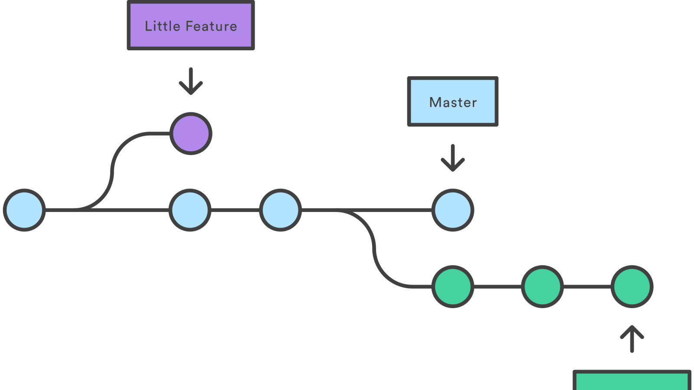

You can collarborate
===========

## Git으로 협업하기
------
 

### Git 브랜치란? 

 

    `Git`은 버전관리도구이자 협업을 위한 도구입니다. 
    버전관리를 위해 4가지 영역이 있었다면 협업을 위해서는 브랜치라는 영역이 있습니다. 
    브랜치는 하나의 나무가지가 여러개로 뻗어나가는 것처럼 여러가지의 가지를 만든 후 해당 가지에서 각자 개발 후 나중에 합치는 협업의 영역입니다.
    여기서 해당 가지는 역할에 따라 나눌 수 있고 요구사항에 따라 나눌 수 도 있습니다.

 

브랜치의 주요 용어로는 `Branch`, `Merge`, `HEAD` 입니다. Branch는 분기하다와 브랜치 그 자체의 뜻을 가지고 있습니다. 분기하다는 가지를 치는 것 처럼 새로운 브랜치를 생성하는 것입니다. 그리고 Merge는 생성한 브랜치를 서로 합치는 의미를 가지고 있습니다.
마지막으로 HEAD는 현재 작업 중인 포인터를 의미합니다.

 

git branch 생성하기 : `git branch`

 

### Git branch 명령어

 

| 번호 | 명령어 | 기능 |
|---|:---:|:---:|
| 1 | `git switch branchName` | 해당 브랜치로 이동한다. |
| 2 | `git merge branchName` | 해당브랜치와 현재 브랜치를 합친다.  |
| 3 | `git reset hashCode` | 해당 브랜치로 모든 브랜치들을 지우고 옮긴다.  |
| 4 | `git branch -d branchName` | 해당 브랜치를 지운다. |

 

### Git branch 관련 유용한 명령어

 

| 번호 | 명령어 | 기능 |
|---|:---:|:---:|
| 1 | `git log --oneline` | 한줄로 변경 내역을 확인한다. |
| 2 | `git log --oneline --branch --graph` | 한줄로 브랜치 현황까지 확인하되 그래프로 확인한다.  |
| 3 | `git log master..branchName` | 해당 브랜치와 master브랜치의 차이점을 확인한다.  |
| 4 | `git stash` | 수정 중인 파일 감춘다. |
| 5 | `git stash pop` | 숨긴 파일을 다시 내보낸다. |

 

### Git 브랜치를 사용하면서 애매한 상황

 

1. 합병했는데 내용이 겹칠 경우 어떻게 처리되나요?
    - 합병하려고 하면 깃이 브랜치 충돌을 알려줍니다. 다시 해당 파일을 수정하려고 하면 어디 부분이 어떤 브랜치는 어떻게 수정했는지 친절하게 알려주기 때문에 원하는 방향으로 수정하면 됩니다.
2. 브랜치를 지우면 완전히 없지나요?
    - `git branch -d branchName`를 통해 브랜치를 지워도 나중에 다시 같은 이름으로 생성하면 내역이 남아있습니다. <strong>감춘다</strong>는 느낌으로 알면 되겠습니다.
3. `git reset hashCode`의 작동원리
    - `git reset hashCode`은 commit A의 해쉬코드를 입력하면 develop 브랜치가 commit A로 이동하게 됩니다.

 

[블로그 게시](https://dlatqdlatq.medium.com/git%EC%9C%BC%EB%A1%9C-%ED%98%91%EC%97%85%ED%95%98%EA%B8%B0-b673e8d94034)

