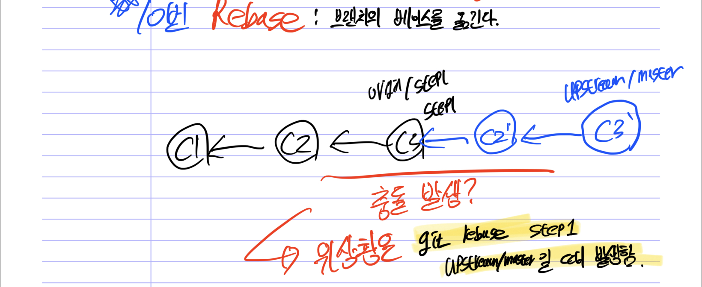
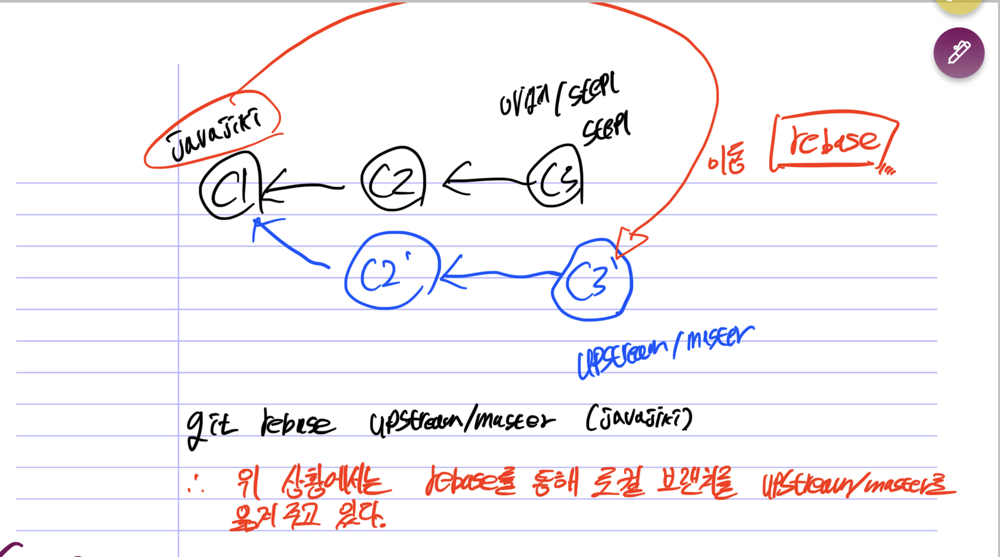

Forking Workflow에서 fetch와 rebase
===

## 들어가기 전에

최근에 부스트캠프 멤버십 과정을 진행하면서 git을 통해 과제 제출을 진행하고 있다.
그러나 난생 처음 들어보는 `forking workflow` 방식과 `git fetch`, `git rebase`등의 명령어를 사용하였다. 이를 바탕으로 나만의 방식으로 어떻게 이해했는지를 적어보려고 한다.

## workflow

git을 공부하다가 branch를 feat, hotfix, relase, dev.. 이런식으로 나눈 것을 본적이 있을 것이다. 이처럼 협업을 위해 특정 규칙을 정의하고 branch를 나누는 것을 git workflow라고 한다.

git workflow에는 다양한 workflow가 존재한다.

* 단일 중앙 저장소를 사용하는 `centralize workflow`
* 핵심 기능별로 branch를 나누는 `feature branch workflow`
* 위 예시인 `gitflow workflow`
* 중앙 원격 저장소와 개인 원격 저장소를 나눠서 작업하는 `forking workflow`

## forking workflow란?

    오픈소스에서 사용되는 방식으로 프로젝트 참여자가 fork저장소와 로컬 저장소를 만들어 협업을 진행한다.

즉, 모든 참여자가 개인 원격 저장소애 push를 하고 PR를 보내 프로젝트 관리자가 병합할지 결정한다.

forking flow는 다른 workflow와는 다르게 2개의 원격 저장소(중앙, 개인)를 사용한다. 이로 인해 직접적으로 중앙 원격 저장소에 미치는 영향이 없으니 부담없이 개발을 할 수 있고 프로젝트 관리자만이 PR를 병합할 수 있으므로 관리도 용이하다.

## forking workflow의 동작방식


forking workflow는 다음과 같이 동작한다.

1. 먼저 중앙 원격 저장소에서 fork를 한다.
2. git clone을 사용하여 로컬 저장소로 옮긴다.
3. 로컬 저장소에 작업을 한 뒤 개인 원격 저장소로 push 한다.
4. 개인 원격 저장소에서 중앙 원격 저장소로 PR를 보낸다.
5. 프로젝트 관리자 판단하에 PR이 병합된다.
6. 로컬 저장소에서 바로 반영될 수 있도록 fetch와 rebase를 한다.
7. 이후 3번 작업부터 반복한다.

## git fetch

forking workflow의 동작방식에서 6번을 보면 로컬 저장소에서 바로 반영될 수 있도록 fetch와 rebase를 한다 했다.

여기서 fetch는 원격 저장소에 있지만 로컬 저장소에 없는 커밋들을 가져온다.

애초에 로컬에서 push하고 PR을 보내기 때문에 로컬 저장소에 없는 커밋들이 있을 수 있는가? 라고 생각할 수 있지만 
PR을 보내고 합쳐지면 내용들은 반영이 되지만 커밋들은 반영이 안되고 새로운 커밋을 생성하여 반영한다. (pull은 fetch + merge이다.)

즉, `PR을 보내고 합쳐지면 커밋 해시값이 달라진다.` 전혀 다른 커밋이 되는 것이다.

## git rebase

git rebase는 명령어 의미대로 base를 재설정한다는 의미를 가지고 있다.


위 상황에서 rebase를 사용하면 다음과 같이 된다.

```shell
$ git checkout experiment
$ git rebase master
```


experiment의 base가 master 앞에 배치된 것이다.

## 내가 고민했던 문제

하지만 얇은 fetch와 rebase의 지식만으로 forking workflow를 수행하기에는 어려웠다. 가장 어려웠던 점은 rebase에 대한 부분이였다.



만약 rebase를 사용한다면 fetch를 사용하고 가져온 중앙 원격 저장소의 커밋들을 내 로컬 저장소에 있는 최신 커밋에 이어주기 때문에 conflict 문제가 발생할 줄 알았다.



    그러나 실제로는 공통 조상 커밋에서 rebase를 수행하기 때문에 가져올 커밋이 없어 단지 브랜치의 위치만 옮겨 문제가 발생하지 않았다.


