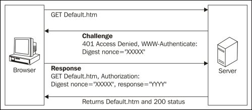
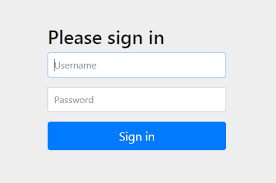

[HTTP] 누가 접근 했는지 확인하는 인증
=======================================

 

## Intro

 

> 웹에서는 특정 인물에게만 보여주고 싶은 정보나 페이지가 있습니다.
즉, 서버에서 누가 요청을 했는지 확인하고 싶을 때가 있습니다.
이번 시간에는 누가 접근 하는지 확인해주는 인증에 대해 알아보겠습니다!

 

## 인증이란?

 

인터넷에서는 대면으로 만나지 않기 때문에 접속한 클라이언트가 누구인지 확인 할 수 가 없습니다. 그래서 인터넷에서도 상대가 누군지 확인하기 위해 `인증`을 통해 확인 할 수 있습니다.

인증의 방법으로는 다음과 같습니다.

- 패스워드 : 사용자가 임의의 문자열로 만든 배열
- 원타임 토큰(OTP) : 본인만이 가지고 있는 기기등에 특정 시간동안에만 표시되는 일회성 패스워드
- 전자 증명서 : 본인만이 가지고 있는 증명서
- 바이오 매트릭스 : 홍채, 지문인식 등의 본인만이 가지는 신체 정보
- IC 카드 : 본인만이 가지고 있는 정보

 

위와 같은 인증 방법은 대부분 <strong>본인만이 가지고 있는 정보</strong>입니다. 따라서 이 정보를 유출되지 않게 조심해야됩니다!

 

## HTTP에서 인증

 

HTTP 역시 비대면이기 때문에 누가 요청을 보냈는지 알 수 없습니다. 그래서 HTTP 또한 HTTP만에 인증 방식이 있습니다.
HTTP에서 인증은 다음과 같습니다.

- BASIC auth
- DIGEST auth
- SSL client auth
- Form Base auth
- Windows auth

 

### BASIC auth

 

`BASIC` 인증 과정은 다음과 같습니다.

1. 클라이언트에서 서버로 요청을 함.
2. 서버에서 401 Unauthorized를 발생시킴.
3. 클라이언트에서 아이디와 패스워드를 `Base64`(공통된 아스키 코드로 인코딩)로 인코딩 하여 다시 서버로 보냄.
4. 서버에서 확인 검사 후 요청에 대해 응답을 함.

과정을 통해 알 수 있다시피 `BASIC` 인증은 아이디와 패스워드를 평문으로 보내고 있습니다. 따라서 도청에 매우 취약하며 로그아웃 로직이 따로 없다는 문제도 있습니다.

이와 같은 문제들로 `BASIC` 인증은 실제로 잘 사용되지 않습니다.

 

### DIGEST auth

 

`DIGEST`인증은 `BASIC` 인증의 취약점을 개선시킨 인증방식으로 
서버는 클라이언트에게 챌린지 코드를 보내고 클라이언트는 챌린지 코드를 계산 후 서버에게 보내 인증 하는 방식입니다.

 

1. 클라이언트가 서버에게 정보를 요청.
2. 서버는 클라이언트에게 401 Unauthorized를 발생시키며 realm, `nonce`, alorithm, qop 등의 속성을 보내준다. (여기서 nonce는 401 응답을 반환할 때마다 생성되는 유일한 문자열입니다. 재전송 방지)
3. 클라이언트는 뒤섞어 놓은 비밀번호(아이디, 비밀번호, nonce)를 보내고 서버 역시 비밀번호를 알고 있기 때문에 검사 후 결과에 따라 200 성공, 401 상태 코드로 응답을 한다.

 

`DIGEST`인증 역시 기존의 `BASIC` 인증보다 뛰어난 성능을 가지고 있지만 위장을 방지하는 기능은 제공하지 않는 등, HTTPS의 클라이언트 인증에 비해 낮은 보안 수준을 갖고 있습니다.

 

#### 추가

 

처음 `DIGEST`인증에 대해 공부 했을 때는 어떤식으로 인증을 하는지 이해가 되지 않았습니다.

먼저 클라이언트가 서버로 부터 `nonce`값을 받게 되고 MD5 암호화 방식으로 Hash1(id, password)를 넣어 해쉬값을 받습니다.
그리고 요청에 따라 메서드를 가져오거나 게시할 수 있는 Hash2(digestURL)를 넣어 해쉬값을 받습니다.

이후 MD5(Hash1, Hash2, nonce)를 넣어 한번 더 암호화를 하여 서버로 보냅니다.

그리고 서버에서는 해당값을 분석하여 비밀번호를 찾아 검사합니다.

 

### SSL client auth

 

`SSL client` 인증은 HTTPS의 클라이언트 SSL를 이용한 방식으로 사전에 등록된 클라이언트에서의 액세스인지 아닌지를 확인합니다.

하지만 `SSL client` 인증 방식은 인증 기관에서 SSL를 가져오는 것이기 때문에 비용이 많이 발생합니다.

따라서 대중적으로 사용하지 않고 오히려 뒤에 설명할 폼베이스 인증 방식과 같이 사용하는 2-factor 인증방식에서 사용됩니다.

 

### Form Base auth

 

`Form Base` 인증 방식은 대중적으로 많이 사용하는 방식으로 우리가 알고 있는 아이디 비밀번호를 입력하는 방식입니다. 하지만 이 방식은 인증 기능으로서 표준화가 되지 않았기 때문에 각각의 페이지 마다 조금씩 다른 방식으로 운영됩니다. 그래서 안전한 방법으로 구현을 해야합니다.

`Form Base` 인증 방식으로 인증을 하면 HTTP는 stateless 특징을 가지고 있기 때문에 요청을 할 때마다 인증을 해야합니다. 이를 개선하기 위해 쿠키, 세션 개념을 사용하고 있습니다.

1. 아이디와 패스워드를 서버에게 보낸다.
2. 서버에서 세션아이디를 생성하고 클라이언트에게 보낸다.(세션아이디 역시 도청을 당하면 안되므로 Httponly 속성과 유효기안을 부여한다.)
3. 클라이언트는 세션아이디를 쿠키로 저장하거나 요청을 할 때 마다 세션아이디를 같이 보낸다.

 

## 참고

 

- [기본인증, 다이제스트 인증](https://ideveloper2.dev/blog/2019-11-23--%EA%B8%B0%EB%B3%B8-%EC%9D%B8%EC%A6%9D-%EB%8B%A4%EC%9D%B4%EC%A0%9C%EC%8A%A4%ED%8A%B8-%EC%9D%B8%EC%A6%9D/#%EA%B8%B0%EB%B3%B8%EC%9D%B8%EC%A6%9D)
- [HTTP 인증 및 기본 및 요약 이해](https://johyungen.tistory.com/351)