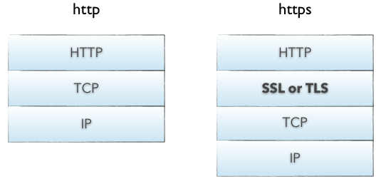
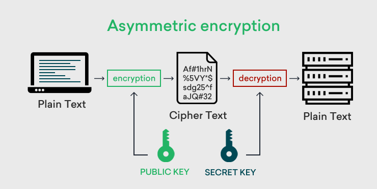

HTTPS that safety protect Web!
====================

 

## 서론

 

    HTTPS는 HTTP + Secure 로 HTTP의 보안 취약점을 보완해주는 별도의 프로토콜이다. 이번 글에는 HTTPS를 왜 사용하는지, 어떻게 적용되는지 알아볼 것이다.

간단하게 `HTTP`에 대해 설명해보자면 HTTP는 TCP/IP 4 계층 중 애플리케이션 계층에 해당되는 프로토콜이며 클라이언트와 서버간의 요청과 응답을 담당하는 프로토콜이다.

 

------

 

## HTTP의 보안 취약점

 

HTTP의 보안 취약점은 다음과 같다.

1. 평문이기 때문에 누구든 <strong>도청이 가능</strong>
    - HTTP를 사용한 통신 내용은 암호화 기능이 없기 때문에 평문으로 통신하여 누구든 도청이 가능하다.
2. 통신 상대를 확인하지 않기 때문에 <strong>위장 가능</strong>
    - 요청을 받은 웹서버가 원래 의도한 응답을 보내야 하는 웹서버인지 아닌지를 확인할 수 없다. (위장한 웹서버일 수 있음.)
    - 응답을 받은 클라이언트가 원래 요청을 보낸 클라이언트인지 확인 불가능하다.
    - 통신하고 있는 상대가 접근이 허가된 상대인지 확인할 수 없다.
    - 누가 요청을 했는지 확인할 수 없다.
    - 의미없는 요청이여도 수신하게 된다. (DoS 공격 방지 불가)
3. 완전성을 증명 할 수 없기 때문에 <strong>변조 가능</strong>
    - 수신한 내용이 다를 수 도 있다! 즉, 중간에 변조자가 생겨 응답이나 요청내용을 바꿀수도 있다.(man-in-the-middle attack)

 

## HTTP 보안 문제점을 어떻게 해결 할 수 있는가?

 

이처럼 HTTP는 간단한 구조를 갖고 있기 때문에 다양한 부분에서 보안 취약점을 발견할 수 있었다. 그럼 어떻게 해결 할 수 있을까?

HTTP의 보안 문제를 해결할 수 있는 방안으로는 다음과 같다.

1. IPSec and VPNS
2. `TLS` & `SSL`
3. OSPF authentication
4. SNMP v3
5. Application Transparent Transport Layer Security
6. Kerbros

이 중에서 대중적으로 많이 쓰이는 방안은 TLS & SSL이다.

`SSL`은 Security Socket Layer로 신뢰성 있는 기관에서 서버나 클라이언트가 실재하는 존재를 증명해준다. 해당 증명서를 통해 클라이언트와 서버는 신뢰성 있게 통신을 할 수 있으며, 증명서를 도청, 위조, 변조하기 매우 까다롭기 때문에 HTTP의 보안 문제를 해결 할 수 있다.

 

### 그렇다면 앞서 설명했던 보안 취약점들을 어떻게 SSL로 해결할 수 있을까?

 

1. SSL를 통해 통신 내용을 암호화 하여 안전한 통신로를 확보하여 도청을 못하게 한다.
2. SSL은 상대를 확인할 수 있는 증명서를 통신 초기에 발행하기 때문에 위장을 못하게 한다.
3. SSL에는 인증이나 암호화 다이제스트 기능을 제공하고 있어 변조하기 까다롭게 한다.

 

## HTTPS는 무엇인가?

 

앞서 살펴본 내용을 정리하면 다음과 같다.
    
    HTTPS = HTTP + 암호화 + 인증 + 완전성 보호

하지만 부가기능이 이렇게 많은데 어떻게 간단한 HTTP구조에 구현하는지에 대해 궁금해 할 수 있다. HTTPS는 기존 애플리케이션 계층과 트랜스포트 계층 사이에 SSL이라는 새로운 프로토콜을 추가한 것 이다.

 

### 암호화 방식

 

HTTPS의 암호화 방식을 설명하기 앞서 공통키 암호화에 대해 알아보면 다음과 같다.

    공통키라는 키를 클라이언트와 서버에 제공하여 통신 내용을 암호화 하거나 복호화 할 때 공통키를 사용한다.

하지만 공통키 암호화방식은 공격자가 공통키를 얻었을 경우 공격자 역시 암호화나 복호화가 가능하다는 문제점이 있다.

 

이를 개선한 것이 두 개의 키를 사용하는 공개키 방식이다.

 

공개키 암호화 방식은 다음과 같다.

 

먼저 공개키와 비밀키로 구성되어있다. 공개키는 통신을 할 때 증명서와 함께 보낸다. 그리고 다시 데이터를 요청할 때 공개키로 암호화 해서 요청내용을 숨긴다. 이후 암호화된 요청을 비밀키로 복호화 하여 해당 내용을 확인한다. 즉, 공개키로 암호화 하면 비밀키로 복호화가 가능하고 비밀키로 암호화 하면 공개키로 복호화가 가능하다.

하지만 여기서 공개키의 신뢰성 문제가 생길 수 있다. 이러한 신뢰성 문제를 해결하기 위해 CA(Certificate Authority)와 CA가 발행하는 공개키 증명서가 이용되고 있다.

이처럼 공개키는 이상적인 통신 방식이지만 HTTPS에서는 매우 많은 컴퓨터 자원을 사용하기 때문에 위의 방식을 사용하지 않는다.

그렇다면 HTTPS는 어떻게 통신을 할까?

 

### HTTPS의 통신 구조

 

HTTPS는 공개키와 공통키를 혼합하여 사용한다.

    HTTPS의 통신은 크게 HandShake - Session - Session End로 나타낸다.

 

HandShake

1. Client Hello 
    - 클라이언트에서 생성한 랜덤데이터를 전송
    - 암호화 방식 협상
    - 세션 아이디 (이미 SSL를 했다면 시간 절약을 위해..)
2. Server Hello
    - 서버에서 생성한 랜덤데이터를 전송
    - 암호화 방식 결정
    - 인증서

3. CA authentication : CA를 통해 클라이언트가 서버의 인증서를 신뢰할 수 있는지 확인. 이후 랜덤데이터를 합쳐 Pre-master secret를 생성 이 키는 세션에서 서로 주고받을 데이터를 암호화 할 때 사용(따라서 절대 유출 되면 안됨!) Pre-master secret를 유출 없이 전달하기 위해 공개키로 암호화 & 비밀키로 복호화함.

4. Session key생성 : Pre-master secret -> master secret -> Session key 생성 이후 Session key를 공통키로 하여 공통키 암호화 방식을 사용

5. HandShake 종료 : 서로에게 종료를 알린다.

 

Session

Session key를 공통키로 하여 데이터 전송을 함. 서로 Session key를 알고 있기 때문에 암호화&복호화 가능.

 

Session End

서로에게 SSL 통신이 끝났음을 알린다.

-----

[미디엄 블로그에서 확인 하기](https://medium.com/nemne/%EC%9B%B9%EC%9D%84-%EC%A7%80%EC%BC%9C%EC%A3%BC%EB%8A%94-https-2a14d91f945)
