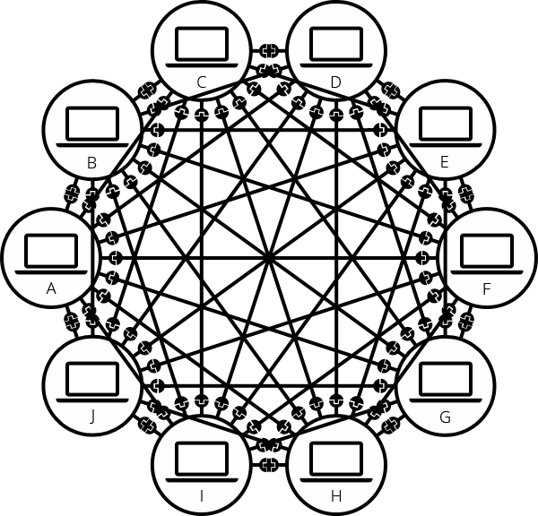
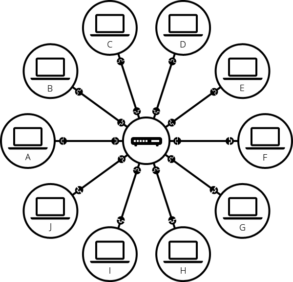
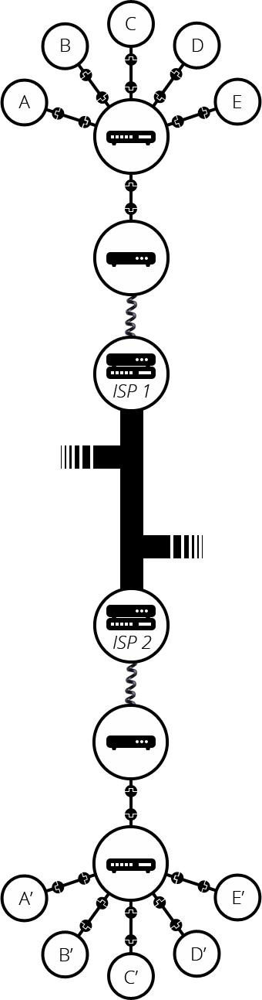
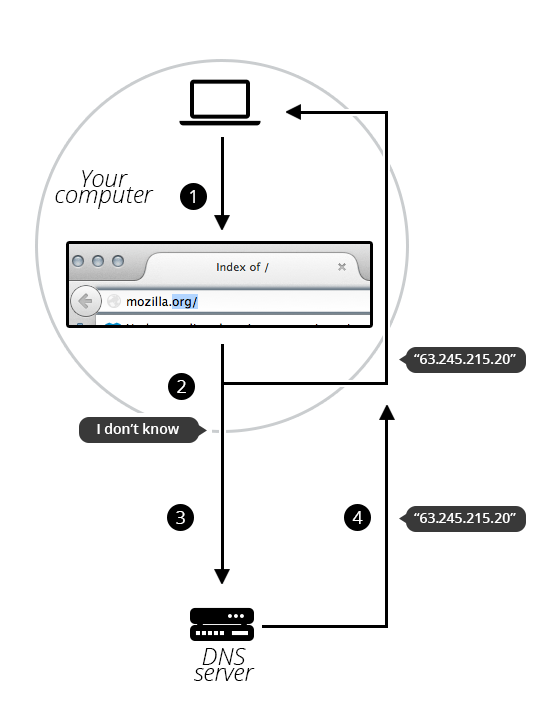

What is web?
======

 

## 인터넷? 웹? 네트워크..?

 

인터넷, 웹, 네트워크는 일반 사용자들도 자주 사용하는 단어이지만 단어의 의미에 대해 설명을 못할 정도로 단순히 단어만 알고 있다. 사실 자주 혼용하는 이 단어들은 서로 다른 의미를 가진다.

먼저 `컴퓨터 네트워크`(net + work)는 하드웨어간의 통신망을 의미한다. 즉, 여러 하드웨드들이 자원을 공유할 수 있게 하나의 Net(망)으로 묶어 통신을 할 수 있게 해준다.

`인터넷`은 네트워크의 네트워크로 불릴정도로 또 다른 연결망인데 이는 네트워크들을 TCP/IP라는 통신 규약(Protocol)을 통해 연결하여 전 세계적으로 정보를 주고 받게 해주는 네트워크이다. 즉, 인터넷(Internet)은 Inter + Network로 서로 다른 네트워크들을 통신 규약에 의해 연결을 해준다.

 

    그렇다면 이미 하드웨어끼리 연결된 망을 굳이 또 연결을 해야 할까? 

그 이유는 단순하다. 더 많은 연결을 하고 싶었기 때문이다. 네트워크의 연결 범위와 연결 가능 하드웨어수는 매우 한정적이다. 하지만 인터넷은 추후에 설명할 (World Wide Web)을 제공할 정도로 네트워크와는 다르게 많은 연결이 가능하기 때문이다. 이렇게 많은 연결을 하면 자원도, 공유도 많아지므로 생산성에서 효율적이다.

`웹`은 이메일처럼 인터넷이 제공하는 서비스 중 하나이다. 하지만 인터넷 ≒ 웹이라고 생각할 정도로 웹은 엄청난 성장을 하였지만 명백하게 웹과 인터넷은 다른 개념이다.

<strong>웹은 단순히 웹 브라우저를 통해 정보 검색을 하는 서비스이다.</strong> 그래서 검색을 하는 행위를 웹 서핑, 웹 브라우징이라고 부른다. 웹의 특징으로는 웹 자원에 접근하는 프로토콜을 가지고 있으며, HTML등의 언어로 자신만의 웹페이지를 만들 수 있고 , URL이나 하이퍼 텍스트 처럼 웹 자원의 위치지정 방법을 가지고 있다.

 

## 그렇다면 인터넷은 어떻게 동작할까?

 

이해하기 쉽게 유선으로 인터넷을 연결해본다고 가정하자.
간단하게 2대의 컴퓨터를 연결하기 위해서는 케이블 선 하나만 필요할 것이다. 그렇다면 10대의 컴퓨터는 어떻게 연결해야할까?

 

 

물리적으로 연결한다면 45개의 케이블이 필요하다. 고작 10대만으로도 45개의 케이블이 필요한데 실제로 100대 이상의 컴퓨터들은 무수히 많은 케이블로 연결할까?
위의 문제를 해결하기 위해서 라우터라는 일종의 작은 컴퓨터가 등장한다. 라우터는 B라는 컴퓨터가 F 컴퓨터에게 메세지를 제대로 전달하는지, 최적의 경로에 따라서 전달했는지 등을 처리해준다.

 

 

따라서 라우터의 등장으로 무수히 많은 케이블들은 라우터 하나로 45개에서 10개로 획기적으로 줄었다.
라우터를 통해 컴퓨터들간의 연결이 직관적이고 편리해졌다. 그러나 만약에 다른 지역, 다른 나라에서의 연결은 어떻게 해야할까? 계속 라우터들을 연결하여 다른 지역과 연결을 할 수 있다고 생각할 수 있지만, 이는 불가능에 가까우며 매우 비효율적이다.

 

 

그러나 우리는 이미 다른 지역, 다른 나라와의 연결을 이미 성공하고 잘 사용하고 있다. 바로 전화다. 그래서 이를 이용할 수 있게 해주는 기계가 바로 모뎀이다.

`모뎀`은 아날로그/디지털 변환기로 컴퓨터의 디지털 신호를 아날로그 신호로 바꿔 보내고 다시 아날로그 신호를 디지털 신호로 바꿔 읽는다.

모뎀을 통해 네트워크가 전화시설에 연결되었다. 그 다음으로 다른 네트워크로 메세지를 보내려면 `ISP(Internet Service Provider)`를 통해 연결을 해야한다. ISP는 인터넷에 접속하는 수단을 제공해주는 업체로 한국에서는 U+, SK, KT가 있다.

 

## 웹은 어떻게 동작할까?

 

위의 내용을 요약하면 <strong>인터넷은 네트워크 기반으로 한 하나의 기술 인프라</strong>이고 <strong>웹은 이러한 인프라를 바탕으로 구축된 서비스이다.</strong> 즉 수 많은 연결들 중에서 일부는 ‘웹 서버’로 웹 브라우저가 이해할 수 있게 서비스를 제공할 것이다.

 

 

웹은 일반적으로 요청하는 클라이언트와 응답을 하는 서버로 나눈다. 클라이언트가 서버에게 특정 자원을 요청하면 서버는 해당 자원을 찾고 클라이언트에게 보낸다. 

여기서 클라이언트는 우리가 사용하는 컴퓨터나 휴대폰이 될 수 있고 서버는 해당 자원 저장한 컴퓨터이다.

그러면 예시로 내가 네이버에 접속을 한다고 하면 먼저 브라우저 주소창에 www.naver.com이라고 입력을 하고 엔터를 눌러 접속을 할 것이다.

보기에는 보잘 것 없는 행동이였지만 사실은 이 과정을 통해 웹의 동작 방식을 볼 수 있다.

먼저 주소 입력부터 보면 우리는 그동안 www.naver.com이라고 입력을 했을 것이다. 그런데 0과 1만 아는 컴퓨터가 위 내용을 어떻게 이해할까?

 

 

사실은 `IP Protocol`에 의해 IP Address로 명시해야한다. 예를 들면 125.209.222.141과 같은 조합이다. 하지만 아무 의미 없는 숫자 덩어리를 쉽게 기억할리가 없다. 그래서 등장한게 `DNS(Domain Name System)`이다. DNS를 통해 IP Address가 www.naver.com으로 바뀐다.

즉, 클라이언트가 Domain Name을 입력해도 DNS 서버에서 진짜 IP Address를 찾아 접속한다.

접속한 후 HTTP요청에 따라 서버에게 네이버 홈페이지.html 파일을 요청한다. 추가로 클라이언트와 서버 사이의 요청은 TCP/IP 연결에 따라 전송된다.

데이터 요청을 받은 후 서버는 해당 데이터를 찾고 해당 데이터를 패킷 단위로 쪼개어 데이터를 전송한다. 패킷으로 보내는 이유는 데이터를 한번에 보내면 다양한 사용자들이 동시에 데이터를 못받기 때문이다.

이러한 패킷을 받은 브라우저는 하나씩 조합하여 새로운 Naver 홈페이지를 클라이언트에게 보여준다.

 

--------

 

이번 글을 통해 웹과 인터넷의 차이와 동작원리를 다시 정리하게 되었고 정리하는 과정에서 DNS, 패킷, 모뎀, 라우터 등의 개념도 알게 되었다.

`네트워크` => 하드웨어간의 통신망

`인터넷` => 네트워크 기술을 바탕으로 구현한 인프라

`웹` => 인터넷의 인프라를 기반으로 한 서비스

`라우터` => 네트워크 간의 통신을 위해 목적지까지 최적의 경로를 계산하고 해당 
경로를 따라 다른 통신망으로 통신할 수 있도록 해주는 장치

`모뎀` => 아날로그/디지털 변환기

`ISP` => 인터넷에 접속하는 수단 제공

`DNS` => 사람이 읽을 수 있는 주소를 컴퓨터가 읽을 수 있도록 바꿔주는 시스템

`패킷` => 통신망의 전송을 쉽게하기 위한 데이터 전송단위

 

## 참고 및 이미지 출처

 

- [웹의 동작 방식](developer.mozilla.org)

- [인터넷은 어떻게 동작하는가?](developer.mozilla.org)

