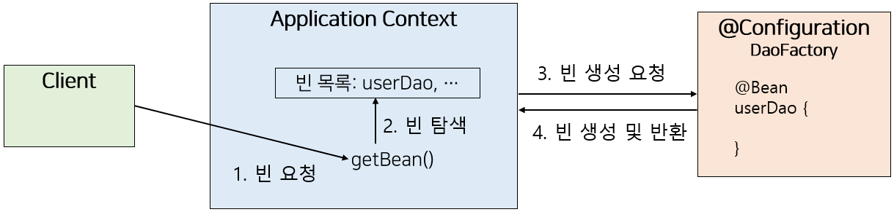

# IoC란?

    이들 중 가장 중요한 것은 Spring Framework의 IoC(Inversion of Control) 컨테이너입니다. Spring Framework의 IoC 컨테이너에 대한 철저한 처리는 Spring의 AOP(Aspect-Oriented Programming) 기술에 대한 포괄적인 범위로 밀접하게 이어집니다. Spring Framework에는 개념적으로 이해하기 쉽고 Java 엔터프라이즈 프로그래밍에서 AOP 요구 사항의 80% 스위트 스팟을 성공적으로 해결하는 자체 AOP 프레임워크가 있습니다.

## 기존의 문제점

```java

public class ClubServiceLogic implements ClubService {
    private ClubStore clubStroe;

    public ClubServiceLogic(){
        this.clubStore = new ClubMapStore();
    }

    ...

}

```

위 코드에서는 ClubServiceLogic 인스턴스를 생성하게 되면 내부 속성인 clubStore가 ClubMapStore로 할당해준다.

그러나 위 방식은 ClubServiceLogic와 ClubMapStore간에 `강력한 결합`을 이끌어낸다.

이렇게 결합도가 높으면 변경에 취약하게 된다.

## IoC

그러나 IoC는 객체 생성의 책임을 컨테이너에게 위임하여 객체 간의 결합도를 낮춘다.

IoC를 통해 기존의 객체를 할당하는 코드를 지운다.

IoC는 구현 방법에 따라 Dependency LookUp과 Dependency Injection으로 나뉜다.

### Dependency LookUp vs Dependency Injection

Dependency LookUp => 개발자가 직접 컨테이너에서 제공하는 API를 이용하여 Bean 객체를 찾는 것을 뜻함. (그러나 컨테이너 밖에서 실행할 수 없고, 다른 컨테이너로 변경할 경우 이를 처리하기도 까다롭다.)

Dependency Injection => 각 class 사이의 의존관계를 빈 설정 정보를 바탕으로 Container가 자동적으로 연결해 주는 것을 뜻함. (빈 설정 파일에 작성해주기만 하면 된다.)

### DI 방법

생성자 주입

```java

@Service
public class BookService {

    BookRepository bookRepository;

    public BookService(BookRepository bookRepository) {
        this.bookRepository = bookRepository;
    }
}

```

set 메서드 주입

```java

@Service
public class BookService {

    BookRepository bookRepository;

    public void setBookRepository(BookRepository bookRepository) {
        this.bookRepository = bookRepository;
    }
}

```

Autowired 주입

```java

@Service
public class BookService {

    @Autowired
    BookRepository bookRepository;
}

```

### Configuration Metadata 설정하기

Configuration Metadata

    애플리케이션 컨택스트 또는 빈 팩토리가 IoC를 적용하기 위해 사용되는 정보

```xml

<?xml version="1.0" encoding="UTF-8"?>
<beans xmlns="http://www.springframework.org/schema/beans"
       xmlns:xsi="http://www.w3.org/2001/XMLSchema-instance"
       xmlns:context="http://www.springframework.org/schema/context" xsi:schemaLocation="
        http://www.springframework.org/schema/beans https://www.springframework.org/schema/beans/spring-beans.xsd
        http://www.springframework.org/schema/context https://www.springframework.org/schema/context/spring-context.xsd">

    <!-- 일일이 다 등록 시켜주는 것이 번거로워 범위를 지정 -->
   <context:component-scan base-package="io.namoosori.travelclub.spring" />

   <bean id="clubStore" class="io.namoosori.travelclub.spring.store.mapstore.ClubMapStore"/>

   <bean id="clubService" class="io.namoosori.travelclub.spring.service.logic.ClubServiceLogic">
       <constructor-arg ref="clubStore" />
   </bean>
</beans>

```

자바 베이스 코드

```java

@Configuration
public class AppConfig {

    @Bean
    public MyService myService() {
        return new MyServiceImpl();
    }
}

```

@SpringBootApplication을 사용하면 @ComponentScan, @Configuration이 포함되어 있기 때문에 해당 어노테이션 하나만 등록해줘도 된다.

```java

import org.springframework.boot.SpringApplication;
import org.springframework.boot.autoconfigure.SpringBootApplication;

@SpringBootApplication
public class TravelClubApp {

    public static void main(String[] args) {
        SpringApplication.run(TravelClubApp.class);
    }
}

...

import org.springframework.stereotype.Service;

@Service
public class BookService {

    BookRepository bookRepository;

    public BookService(BookRepository bookRepository) {
        this.bookRepository = bookRepository;
    }
}

....

import org.springframework.stereotype.Repository;

@Repository
public class BookRepository {
}

```

### IoC 컨테이너

객체의 생성과 관계설정, 사용, 제거 등의 작업을 실제 코드 대신 독립된 컨테이너가 담당한다.

Spring에서 IoC 컨테이너는 BeanFactory, Application Context가 있다.

Bean Factory

    스프링이 IoC를 담당하는 핵심 컨테이너로 빈을 등록, 생성, 조회하고 돌려주고, 그 외에 부가적으로 빈을 관리하는 기능을 담당
    보통은 이 빈 팩토리를 바로 사용하지 않고 상위 개념인 Application Context를 이용한다.
    클라이언트 요청시 빈 객체 생성
    빈의 라이프 사이클 관리

Application Context

    애플리케이션 컨텍스트는 별도의 설정 정보(Configuration Metadata)를 참고하고 IoC를 적용하여 빈의 생성, 관계설정 등의 제어 작업을 총괄한다.
    빈 팩토리를 확장한 IoC 컨테이너로 빈을 등록하고 관리하는 기본적인 기능은 빈 팩토리와 동일함
    I18N, 리소스 로딩, 이벤트 발생 및 통지 / Spring의 AOP적 특성의 쉬운 통합, Message 자원의 핸들링, 이벤트 발생, WebApplicationContext와 같은 Application 계층의 특정 문맥
    컨테이너 생성 시 모든 빈 정보를 메모리에 로딩함
    싱글톤 레지스트로서의 어플리케이션 컨텍스트임

WebApplication Context

    웹환경에서 필요한 기능이 추가된 애플리케이션 컨텍스트



## Bean

    Spring에서 뼈대를 형성하고 IoC에 의해 인스턴스화, 조립, 관리되고 있는 객체를 Bean이라고 부른다.
    별도의 설정에 의해 의존성이 반영된다.
    Bean 객체는 일반적으로 싱글톤으로 관리한다. (싱글톤으로 관리하는 이유는 대규모 트래픽을 감당하기 위해서이다. 1초에 2500개의 동일한 객체가 생성된다면?)

@Repository => DAO 또는 Repository 클래스에 사용
@Service => 서비스 계층에 사용
@Controller => MVC 컨트롤러에 사용
@Component => 위의 계층 구분을 적용하기 어려운 일반적인 경우에 사용

### Bean Scope

singleton => 컨테이너 당 하나의 인스턴스만 생성
prototype => 컨테이너가 빈을 요청할 때마다 생성
request => http 요청 별로 새로운 인스턴스를 생성
session => 세션 별로 생성

```xml

<bean id="clubService" class="io.namoosori.travelclub.spring.service.logic.ClubServiceLogic" scope="prototype">
       <constructor-arg ref="clubStore" />
</bean>

```

```java

@Service
@Scope("prototype")
public class BookService {
}

```

### Bean 생명주기


빈생성 -> 의존성 주입 -> 사용자 지정 초기 메서드 호출 -> Bean 사용 가능상태 / 컨테이너 종료 -> 사용자 지정 소멸 메서드 호출

다양한 방법으로 Bean 설정 파일을 읽고 인스턴스를 생성한다.
이후 설정 파일을 읽어서 해당 되는 Bean 객체에 의존성을 주입하고 Aware 시리즈 인터페이스를 구현한 경우 해당 메서드를 호출

객체를 생성하는 생명 주기 콜백 메서드는 @PostConstruct, InitializingBean 인터페이스, init-method 속성 순으로 호출된다.

이렇게 등록된 Bean 객체는 필요한 곳에서 사용되다가 컨테이너가 종료되면 객체가 소멸할 때는 비슷하게 @PreDestroy, DisposableBean 인터페이스, destroy-method 속성 순으로 호출된다. ㅇ

[참고](https://haruhiism.tistory ㅇ.com/186)
