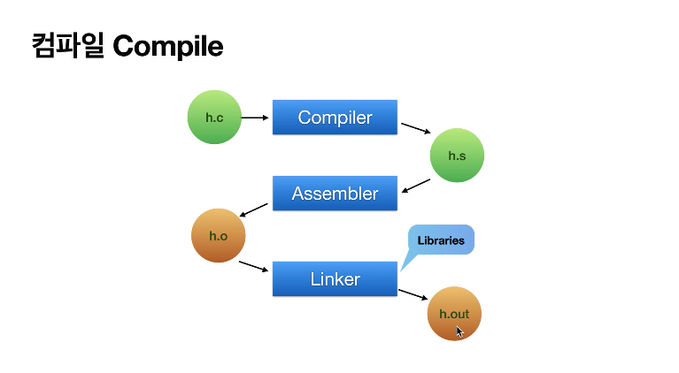
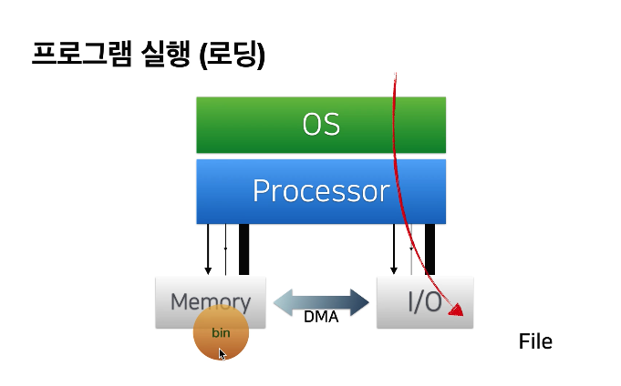
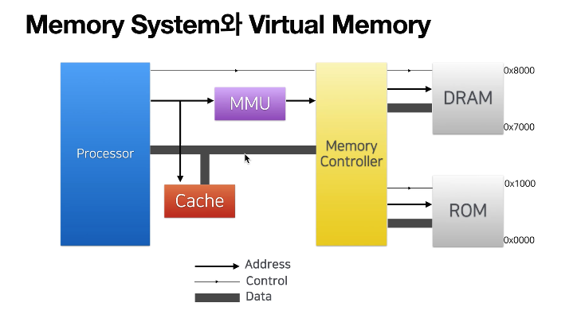

프로세스 메모리 구조
=====

    프로세스 메모리 구조를 이해하기 전에 프로그램은 어떤 과정을 통해 실행되는지 이해해야한다.

## 프로그램 실행과정

자바나 코틀린이나 c 같은 언어는 사용자에 의해 작성된 소스코드 파일을 컴퓨터가 이해할 수 없다.

컴퓨터가 이해하기 위해서는 기계어로 바꿔줘야한다.

바꿔주는 과정은 다음과 같다.

먼저 내가 작성한 소스코드 (.c)파일을 컴파일러를 통해서 어셈블리 코드로 바꿔준다.(어셈블리 코드까지는 사람이 읽을 수 있는 코드이다.)

이후 어셈블러를 통해 우리가 알 수 없는 기계어로 바꾸준다.

마지막으로 링커를 통해 프로그램 내 라이브러리나 함수를 코드에 연결시켜준다.

이렇게 변환된 코드는 컴퓨터에게 일을 시키는 명령(기계어)가 들어있다.

이 코드가 로딩과정을 거쳐 메모리에 올라가게되고 올라간 메모리를 바탕으로 CPU가 계산을 한다.

여기서 로딩과정을 거치고 올라간 메모리가 바로 프로세스 메모리 구조에 올라가게 된다.

또한 프로세스가 메모리를 접근할 때는 직접 디스크에 있는 정보를 가져오는 것이 아닌 주소가 담긴 가상메모리를 MMU와 Cache를 활용해서 가져온다.

## 프로세스 메모리 구조

프로세스 메모리는 크게 4가지 영역으로 나뉜다.

1. stack 영역 : 실행된 함수(매개변수, 리턴값, 지역변수 포함)를 FILO형태로 저장을 한다.
2. heap 영역 : 동적할당(사용자에 의해 생성)된 값들을 저장하는 영역이다.
3. GVAR, BSS영역 : 선언하지 않은 전역변수, 선언한 전역변수를 저장하는 공간이다.
4. text 영역: 소스코드(제어문, 상수)등을 저장하는 공간이다.

그렇다면 stack에서는 어떤 정보를 저장하고 heap에서는 어떤 정보를저장할까?

사진으로 보면 다음과 같다.

스택에서는 특정 데이터를 가진 힙의 주소를 저장한다. 즉, 값을 저장하는 것이 아니라 주소를 저장함으로써 공간에 대한 비용을 절약할 수 있다.