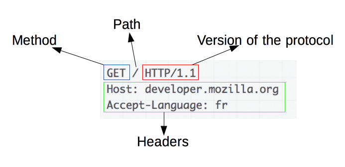

HTTP는 무엇인가?
=================

 

    이제 막 개발 공부를 시작한 전공자나 전공자가 아니더라도 평소에 인터넷을 많이하는 사람들은 주소창에서 있는 https://medium.com/ 이 http(s)를 한번 쯤 봤을 것이다. 이번 시간에는 HTTP가 대략적으로 어떤 기능을 하는지 알아보려고 한다.

 

 

## HTTP란?

 

> HTTP를 공부하면서 느낀 것은 생각보다 다양한 기능들이 많다는 것이다!

 

전공자인 나는 `HTTP(Hyper Text Transfer Protocol)`를 막연하게 클라이언트와 서버가 ‘통신’할 수 있게 해주는 규약으로 알고 있었다.

물론 틀린 말은 아니지만 통신이라는 말안에 엄청난 정보를 담고 있다는 것을 몰랐었다. 서버와 클라이언트가 통신을 하기 위해서는 특정 형식에 맞게 해야 통신이 가능했고 이러한 특정 형식을 통해 클라이언트와 서버간의 통신 다양한 통신 정보와 통신현황을 알 수도 있다.

 

## HTTP 특징

 

> HTTP의 특징들을 보면 단순하다는 것을 알 수 있다.

 

### HTTP는 `Stateless이다`.

 

즉, HTTP는 이전 연결에 대해 알지 못하고 독립적이라는 것이다. 그렇게 되면 현재의 연결에만 집중할 수 있기 때문에 전송을 더 빠르게 할 수 있다.

 

    하지만 로그인의 지속연결이나 쇼핑사이트의 장바구니 기능처럼 이전 연결에 대해 알아야만 하는 경우도 있다. 이럴 경우를 대비해 Cookie나 Session이 있다.

 

### HTTP는 `Connectionless이다`.

 

HTTP는 한번의 요청과 한번의 응답 이후에 연결이 끊어진다. 물론 Connectionless 역시 불필요한 연결을 막아주는 기능을 할 수 있지만 반대로 연결을 다시하는데 비용이 발생한다.

 

    물론 현재에는 이에 대한 해결책으로 Keep Alive나 HTTP/2.0의 Multiplexed Streams이 있다.

 

## HTTP 메세지

 

 

위 메세지 구조를 보면 할 수 있다시피 요청과 응답 메세지는 Start-Line, Headers, Body로 비슷한 구조를 가지고 있으며 Start-Line을 통해 통신에 대한 요청과 응답을 1줄로 요약을 해주며 Header는 요청/응답 관련 대부분의 정보를 담고 있고 Body는 우리가 클라이언트/서버로 보내는 실질적 데이타이다. 이처럼 HTTP 요청 / 응답 메세지는 복잡하지 않게 이뤄져있다.

    Start-Line은 통신결과를 1줄로 요약해주는 역할을 한다. 

 

요청은 `요청메서드(method)` / 주소 경로 / HTTP 버젼 정보 순으로 알려준다.

 

 

응답은 HTTP 버젼 정보 / `상태 코드(status code)` / 결과 메세지 순으로 알려준다.

 

상태 코드를 통해 알게된 404의 의미…

 

    그 다음으로는 Header이다. Header는 통신에 대한 대부분의 정보를 가지고 있으며 General, Response/Request, Entity로 나눠져있다.

`General Header` : 요청과 응답에 공통적으로 쓰이는 헤더 / 우리가 눈여겨 볼 파트는 date, connection, cache-control이 있다.

`Response Header` : 서버나 응답에 대해 추가적인 정보들이 담긴 헤더 / set-cookie, expires, age, server

`Request header` : 클라이언트나 요청에 대해 추가적인 정보들이 담긴 헤더 / accept(Accept 관련 헤더는 서버에게 클라이언트쪽의 선호와 능력을 알려주는 것이 목적이다)

`Entity header` : 본문에 대해 추가적인 정보들이 감긴 헤더 / content-length, language, encoding….

 

---------

 

HTTP는 개발자가 되기 위해 반드시 알아야하는 개념이라고 생각한다. 비록 이번글에는 HTTP에 대해 대략적으로 글을 작성했지만 앞으로도 관련 개념을 꾸준히 업데이트하려고 한다. 이 글을 통해 HTTP를 더 깊게 공부하는 계기가 되었으면 좋겠다.

## 참고

- https://developer.mozilla.org/ko/docs/Web/HTTP/Overview#http_%EA%B8%B0%EB%B0%98_api
- https://joshua1988.github.io/web-development/http-part1/
- https://gmlwjd9405.github.io/2019/01/28/http-header-types.html
- https://feco.tistory.com/9
- https://developer.mozilla.org/ko/docs/Web/HTTP/Overview#http_%EA%B8%B0%EB%B0%98_api
- https://joshua1988.github.io/web-development/http-part1/