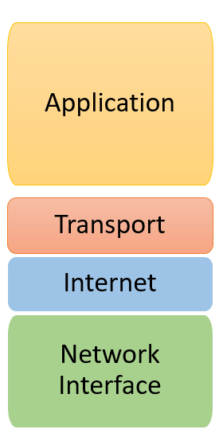
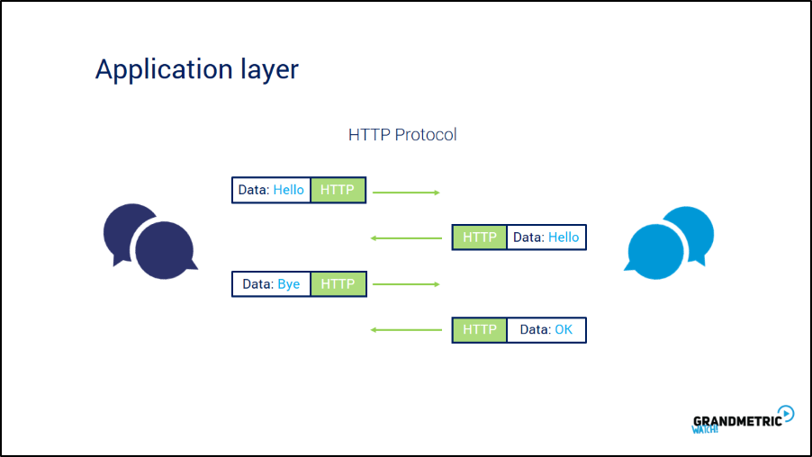
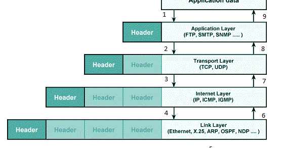
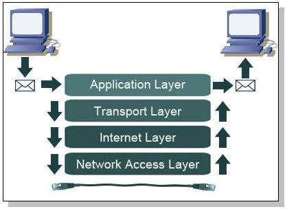

# TCP / IP

 

## 들어가기 전에

 

> TCP/IP 4계층이 뭐였지?  
> TCP/IP? 그거 많이 들어봤는데... 

 

 

 

저에게 있어서 TCP/IP는 친근하지만 정확하게 모르는 개념이였습니다.
그러다가 최근 들어 HTTP를 공부하면서 TCP/IP에 관한 내용이 자주 등장했습니다. 
그래서 "이제 더는 피하기만 하면 안되겠다!" 라는 마음을 갖게 되었고 TCP/IP와 4계층에 관한 글을 작성하게 되었습니다.

 

## TCP/IP는 프로토콜이다!

 

    TCP/IP는 프로토콜입니다. 그렇다면 프로토콜은 무엇일까요? `프로토콜을 일종의 규약`이라고 생각하면 됩니다.

 

그러면 왜 프로토콜을 사용할까요? 불과 몇 십년 전에는 같은 OS끼리만 통신을 할 수 있었습니다.
하지만 오늘날에는 TCP/IP 프로토콜을 이용하여 다른 OS여도 모두 같은 프로토콜을 사용하기 때문에 통신을 할 수 있게 되었습니다.
이처럼 동일한 프로토콜은 통신의 범위를 넓여 주는 기능을 가집니다.

 

## TCP/IP 4계층이란?

 

    프로토콜 개념을 통해 TCP/IP 프로토콜을 왜 사용하는지에 대해 알아봤습니다. 그러면 TCP/IP는 어떤 구조를 가지고 있을까요?

 

 

TCP/IP는 4개의 영역으로, 애플리케이션 계층, 트랜스포트 계층, 인터넷 계층, 네트워크 인터페이스 계층으로 나눌 수 있습니다.

이렇게 4개의 영역으로 추상화한 이유는 독립적인 역할로 나눌 수 있기 때문입니다. 가령 예를 들면 유통 방식 같은 경우 판매자에서 마트까지 운송 작업을 합니다. 
여기서 운송 작업을 디테일하게 표현을 하면 트럭으로 운송을 할 수 있습니다. 하지만 비행기로 운송을 해도 같은 운송 작업을 하는데에 있어 지장이 없습니다. 

즉, `TCP/IP 4계층 역시 계층을 독립적으로 나눠 하나의 계층 수단을 바꿔도 통신이 가능하도록 합니다.`

 

## TCP/IP 4계층의 역할

 

 

`애플리케이션 계층은 실제로 우리가 사용하는 유일한 서비스 계층입니다.` 해당 영역에서의 대표적인 예는 HTTP입니다. 
HTTP는 클라이언트와 서버를 통신하게 해주는 전송 프로토콜입니다. 
즉, 애플리케이션 계층에서는 실질적으로 필요하는 데이터를 요청하고 응답을 해줍니다.

다음은 `트랜스포트 계층`입니다. 이 `계층은 우리가 어떤 프로그램으로 찾아가야하는지에 대해 알려주는 통신 계층입니다.` 
예를 들어 클라이언트 인 8080포트에서 80포트로 데이터가 올바르게 갈 수 있는지를 중계해주는 계층입니다.
또한 통신을 할 때는 서버가 여러 곳에서 통신을 할 수 있게 `패킷`이라는 아주 작은 단위로 나눠서 분산 통신을 합니다. 
여기서 `트랜스포트계층은 패킷 단위로 나눠진 데이터를 어떤 순서로 조합하는지도 알려줍니다.`
트랜스포트 계층에서는 TCP, UDP가 있습니다.

`인터넷 계층은 목적지 컴퓨터까지 올바르게 갈 수 있는지를 중계해주는 통신 계층입니다.`

<strong>트랜스포트 계층과의 차이점은 인터넷 계층은 조금 더 넓은 범위인 목적지 컴퓨터까지 올바르게 가는 것이 목적입니다.</strong> 
반면에 트랜스포트 계층은 목적지 컴퓨터 안에서 올바른 프로그램으로 가는 것이 목적입니다. 

마지막으로 `네트워크 인터페이스 계층`입니다. 네트워크 인터페이스 계층은 마지막 영역이기 때문에 데이터를 이진법에 의한 데이터가 아닌 전기나 광신호로 변환 할 수 있게 해줍니다. 
또한 올바른 하드웨어까지 전송해주는 역할을 합니다.

 

## 각 계층을 통과하는 데이터 형태

 

    그렇다면 TCP/IP 4계층에 있는 계층들은 어떤 형태로 데이터를 전달할까요?

각각의 계층마다 전달할 데이터들이 다릅니다. 즉 정보를 계층에 따라서 나눠서 처리해도 된다는 것입니다. 
그래서 데이터를 전달할 때 `캡슐화` 방식을 사용합니다.

위 그림처럼 애플리케이션에서의 데이터는 우리가 순수 원하는 데이터지만 통신 계층들은 단순히 통신을 위한 영역입니다. 
따라서 헤더라는 영역으로 구분해서 데이터를 담습니다.

 

 

따라서 데이터는 위 그림처럼 흘러갑니다.

 

## 마무리

 

이번 TCP/IP 4계층이라는 주제로 글을 작성하면서 TCP/IP 4계층에 대해 제대로 공부하게 되었습니다.
다음번에 만약에 누군가가 TCP/IP에 대해 물어본다면 간략하게 설명할 수 있겠다라고 생각했습니다. 
TCP/IP라는 방대한 영역을 간략하게 다뤄봤습니다. 그러나 역시 공부해야 할 부분이 여전히 많았습니다.
다음에는 TCP에 대해 초점을 맞춰 글을 작성해보도록 하겠습니다.

[블로그 게시](https://dlatqdlatq.medium.com/tcp-ip-d0741a7a259)
